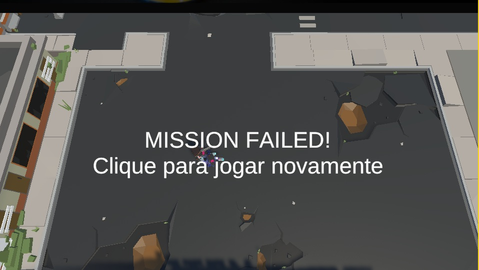
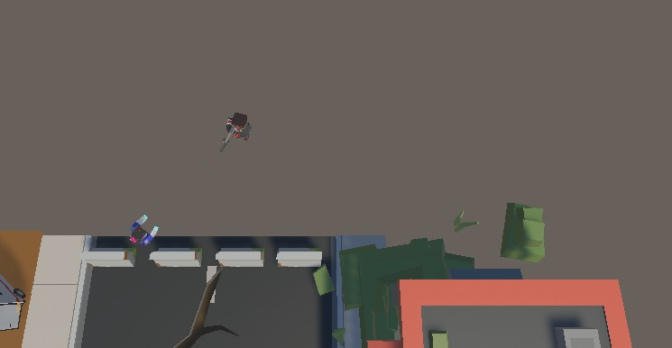
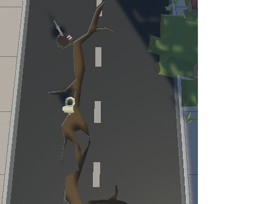
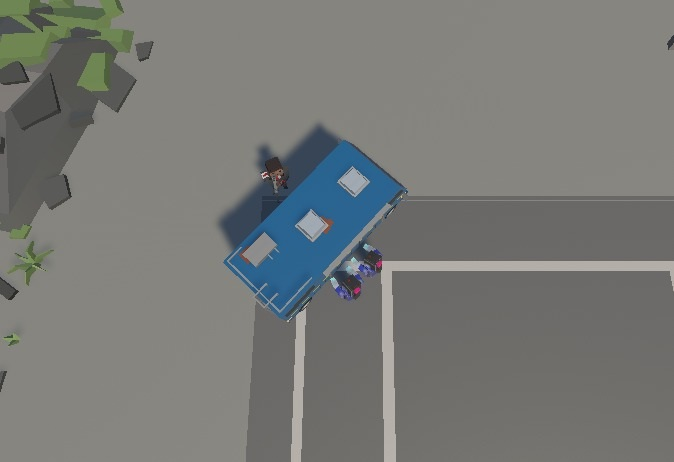
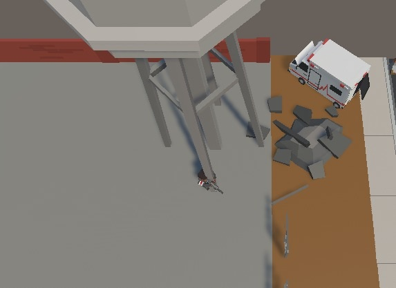

# Atividades do Módulo 3 - QA NA PRÁTICA 📚

Esse [repositório](https://github.com/LeanDevLima/Squad02_M3) é dedicado às atividades realizadas durante o Módulo 3 - QA NA PRÁTICA do curso de Quality Assurance oferecido pelo [**Instituto JogaJunto**](https://www.jogajuntoinstituto.org/). 

 
🚀 Descrição da 10ª Atividade: 🌟

 

🔍Acesse o jogo ZOMBIE BUG HUNTER, no [link do QALAB](https://jogajunto.itch.io/zombiebughunter) 
Exercite a curiosidade e explore o jogo, buscando elementos que podem ser melhorados. 
Relate os bugs, listando-os.

Zombie Bug Hunter - Jogar com bugs não rola, né? Acesse o [link](https://jogajunto.itch.io/zombiebughunter) e ajude a melhorar o jogo.

- A seguir, apresento um resumo das discussões em grupo, no modelo de report que consta na plataforma JogaJunto, complementado por minhas contribuições adicionais:
 
 

| ID | Título | Passo-a-passo | Objetivo | Versão | Plataforma | Navegador | Criticidade | Status | Evidência |
|----|--------|---------------|----------|--------|------------|-----------|-------------|--------|-----------|
| 1  | Início do jogo  | Se o usuário não se locomover assim que inicia o jogo, aparece a tela de  MISSION FAILIED  | Aumentar o timeout | v1.0   | Windows    | Chrome    | Blocker        | Aberto | [evidencia1](Atividades/evidencia_1.jpg)|
| 2  |Durante o jogo | Quando o personagem vai apara extremidade do mapa do jogo,é possivel atravessar objetos do cenários | Melhorar a jogabilidade | v1.0   | Windows      | Firefox   | Grave  | Aberto  | [evidencia2](Atividades/evidencia_2.jpg)| |
| 3  | Perseguição do zumbi | A perseguição do oponente proposto pelo o jogo, não é executada de forma correta, pois o mesmo não consegue perseguir o Personagem | Melhorar a jogabilidade | v1.0   | Windows  | Edge      | Grave       | Aberto |  |
| 4  | Cenário | Item no lugar do cenário | Melhorar a jogabilidade | v1.0   | Windows    | Chrome    | Grave        | Aberto | [evidencia4](Atividades/evidencia_4.jpg)| |
| 5  | Função principal |  O personagem não consegue matar os zumbis  | Melhorar a jogabilidade | v1.0   | Windows        | Brave    | Grave       | Aberto  |  |
| 6  | Zumbi não persegue | Ao se colomover  para atrás de algum objeto no cenário, aguardar os zumbis chegarem, os mesmos não dão a volta para continuar a perseguição | Melhorar a jogabilidade | v1.0   | Windows    | Edge      | Baixa       |  Aberto | [evidencia6](Atividades/evidencia_6.jpg)| |
| 7  | Atravessar cenário | Durante a perseguição dos zumbis o personagem principal consegue atravessar alguns itens do cenário. | Melhorar a jogabilidade | v1.0   | Windows      | Chrome    | Alta        | Aberto | [evidencia7](Atividades/evidencia_7.jpg)| |

- Parafacilitar a visualização, segue abaixo as evidências sitadas na tabela acima:

___
#### Evidencia 1:

___
#### Evidencia 2:

___
#### Evidencia 4:

___
#### Evidencia 5:

___
#### Evidencia 6:

___

## Integrantes da Squad:

| Beatriz Souza  | [Bruno Soares](https://www.linkedin.com/in/bruno-soaresdev/)  | [Leanderson Lima](https://www.linkedin.com/in/leanderson-dias-de-lima/) | [Rebeca Borges](https://www.linkedin.com/in/rebecaborgess/) | Sara Cruz | 