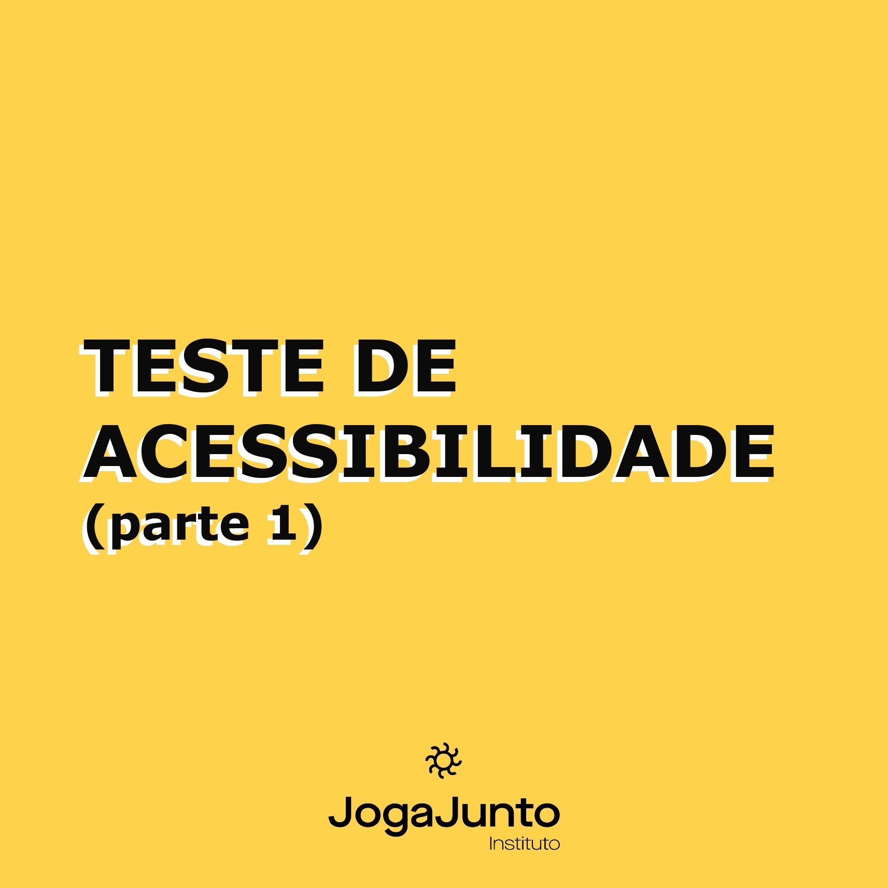
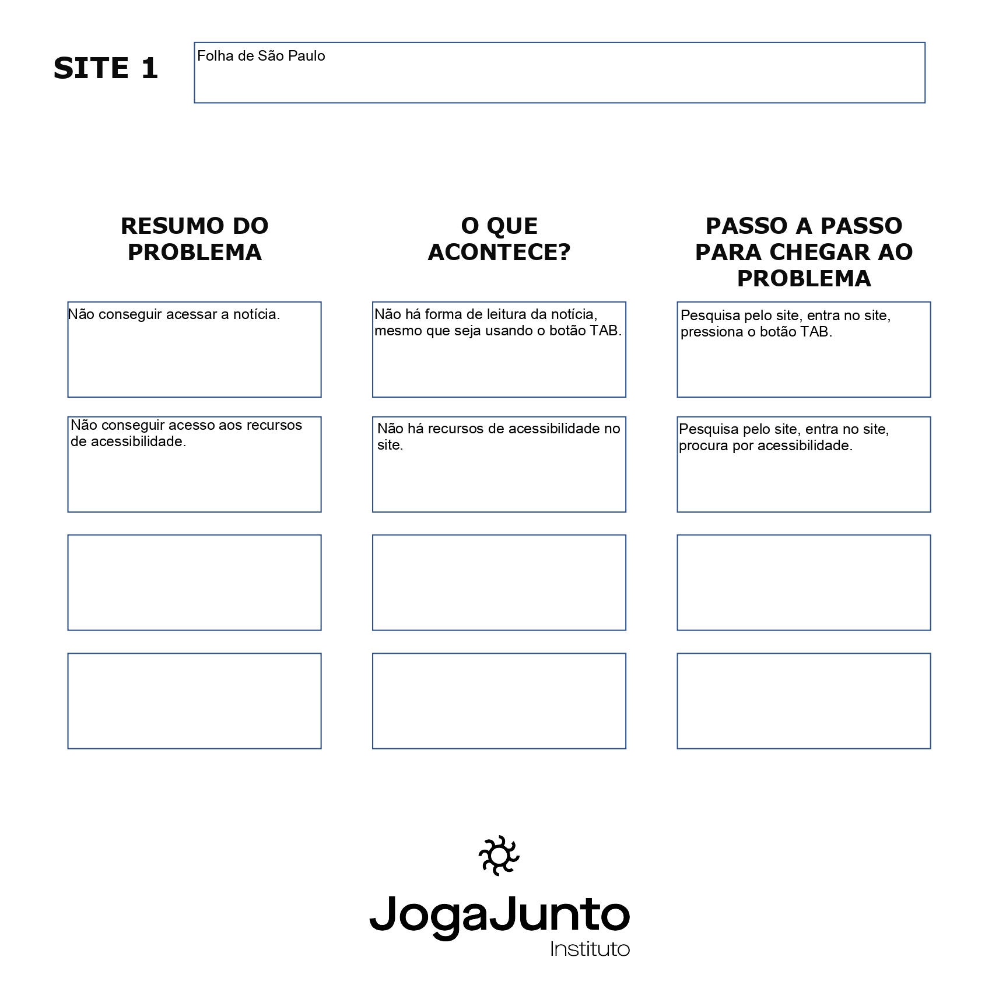
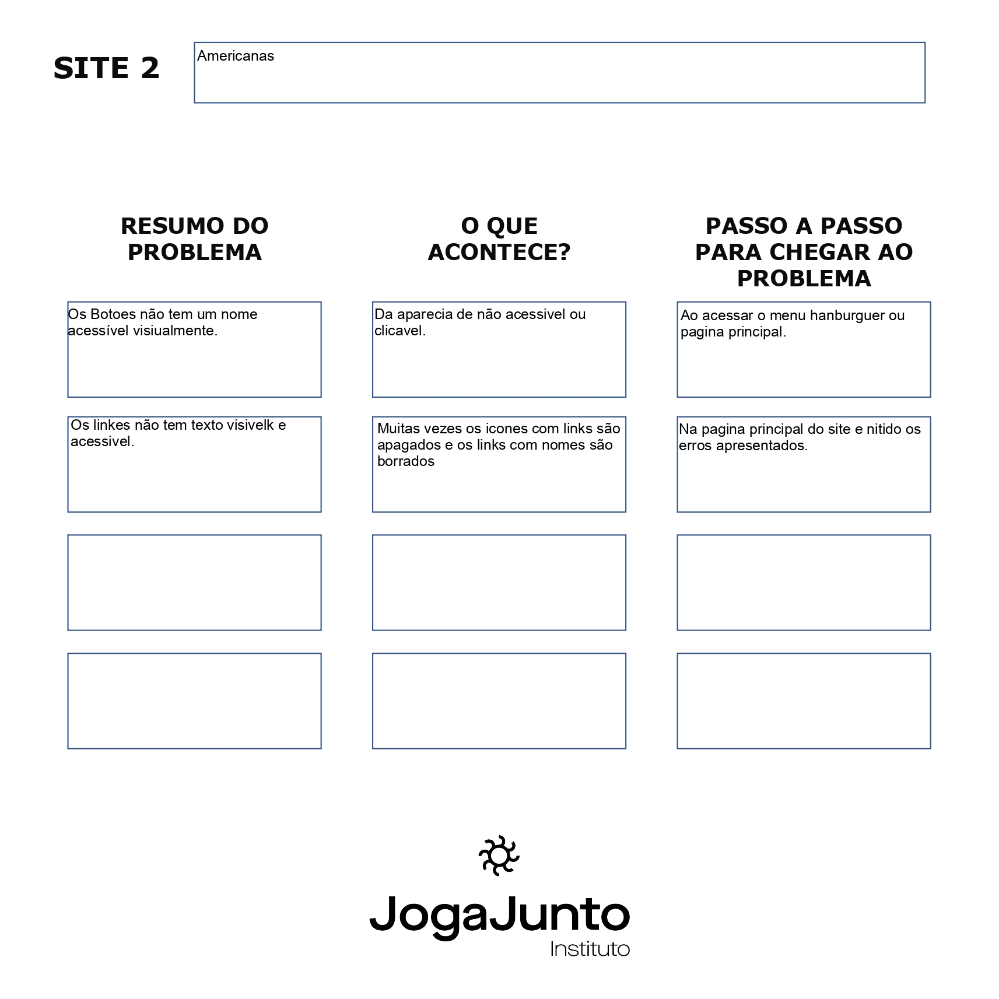
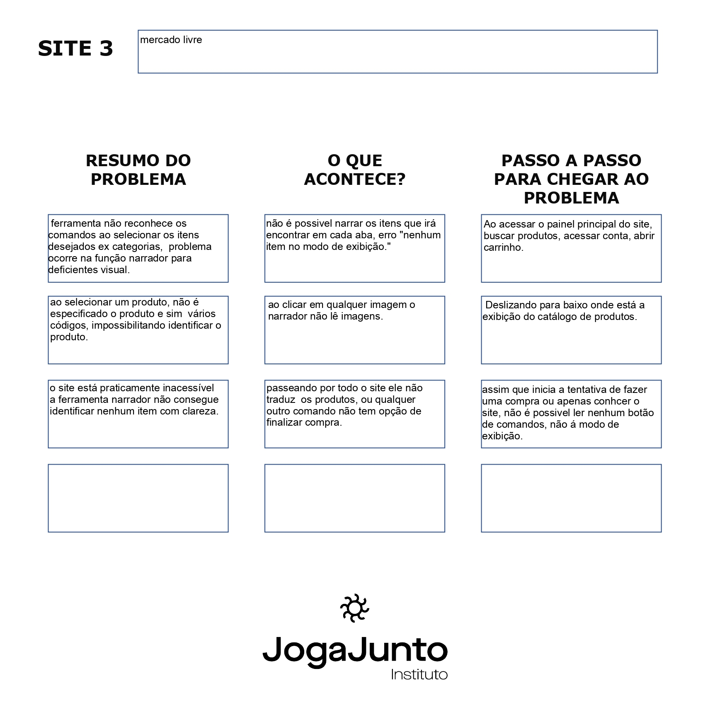

# Atividades do Módulo 3 - QA NA PRÁTICA 📚

Esse [repositório](https://github.com/LeanDevLima/Squad02_M3) é dedicado às atividades realizadas durante o Módulo 3 - QA NA PRÁTICA do curso de Quality Assurance oferecido pelo [**Instituto JogaJunto**](https://www.jogajuntoinstituto.org/). 

 
🚀 Descrição da 11ª Atividade: 🌟

 

🔍Escolha três sites da internet, usando o computador. Após entrar em cada site avalie: 

- É possível navegar sem usar o mouse, apenas usando as teclas TAB e ENTER do teclado?
- Quando você usa a tecla TAB, as seleções de elementos ocorrem de forma sequencial ou aleatória?
- Descreva o que encontrou, no documento disponível para download.

 A seguir, apresento um resumo das discussões em grupo, complementado por minhas contribuições adicionais:

 

 

 

 

## Integrantes da Squad:

| Beatriz Souza  | [Bruno Soares](https://www.linkedin.com/in/bruno-soaresdev/)  | [Leanderson Lima](https://www.linkedin.com/in/leanderson-dias-de-lima/) | [Rebeca Borges](https://www.linkedin.com/in/rebecaborgess/) | Sara Cruz | 