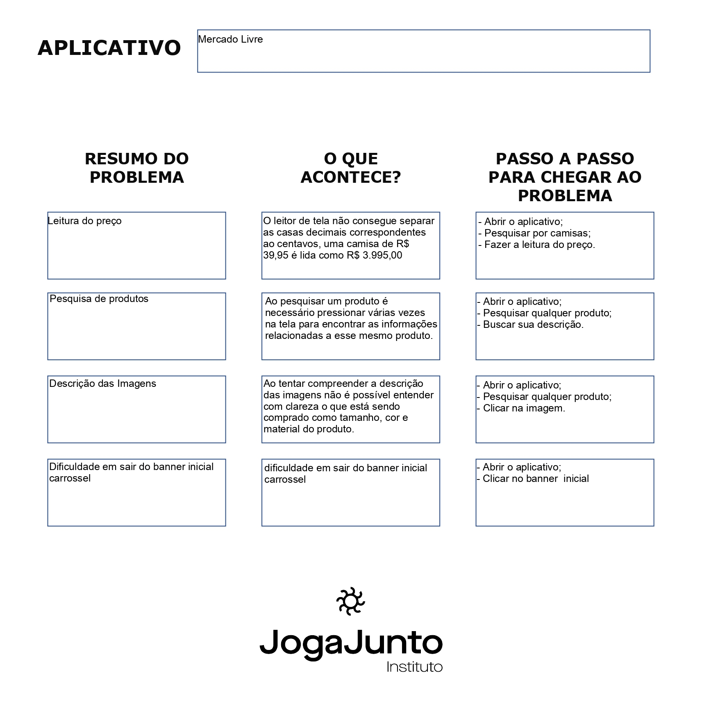

# Atividades do Módulo 3 - QA NA PRÁTICA 📚

Esse [repositório](https://github.com/LeanDevLima/Squad02_M3) é dedicado às atividades realizadas durante o Módulo 3 - QA NA PRÁTICA do curso de Quality Assurance oferecido pelo [**Instituto JogaJunto**](https://www.jogajuntoinstituto.org/). 

 
🚀 Descrição da 11ª Atividade: 🌟

 

🔍Escolha um aplicativo já instalado no celular ou qualquer site da internet.  

- Ative, nos ajustes do seu smartphone, a função leitura de tela, que no iOS é chamada de VOICEOVER e no Android de TALKBACK.
- Abra o aplicativo escolhido, confira se a leitura de tela acontece de forma lógica e se todos os elementos presentes na tela são lidos. 

## Integrantes da Squad:

| Beatriz Souza  | [Bruno Soares](https://www.linkedin.com/in/bruno-soaresdev/)  | [Leanderson Lima](https://www.linkedin.com/in/leanderson-dias-de-lima/) | [Rebeca Borges](https://www.linkedin.com/in/rebecaborgess/) | Sara Cruz | 