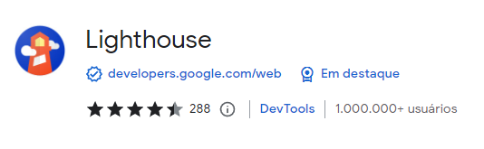
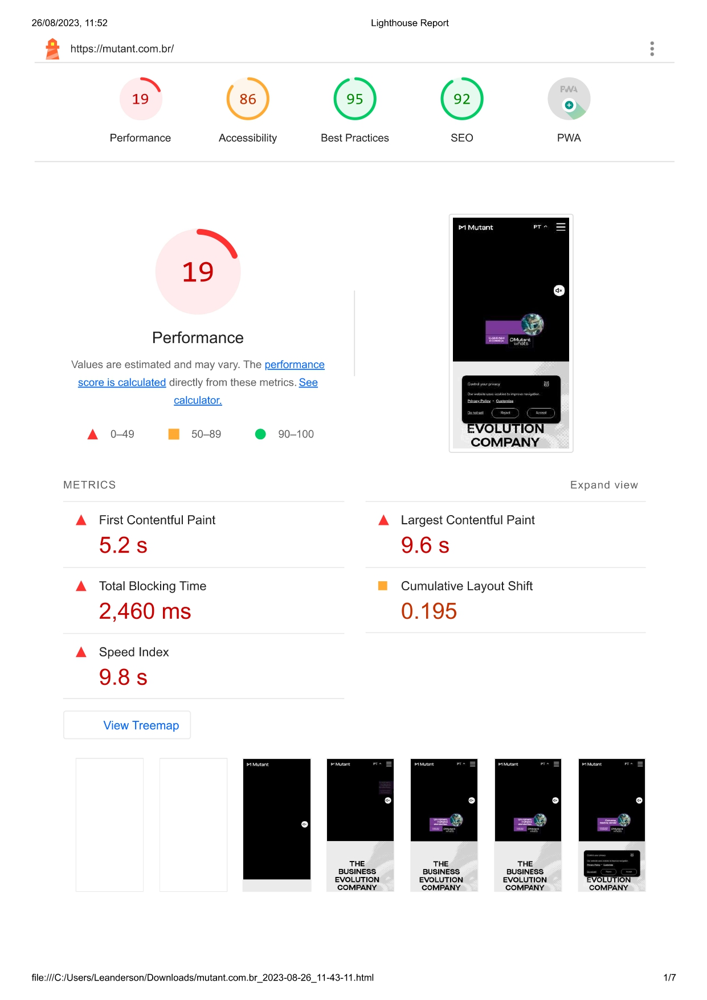
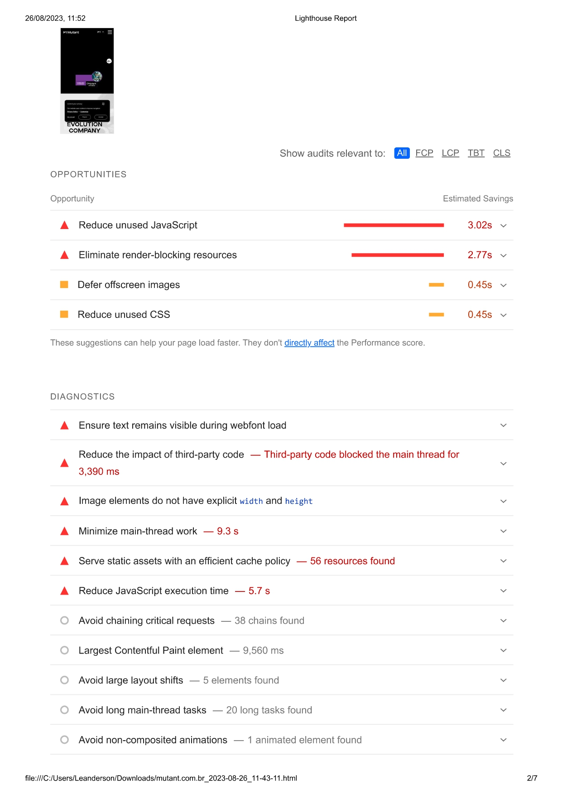
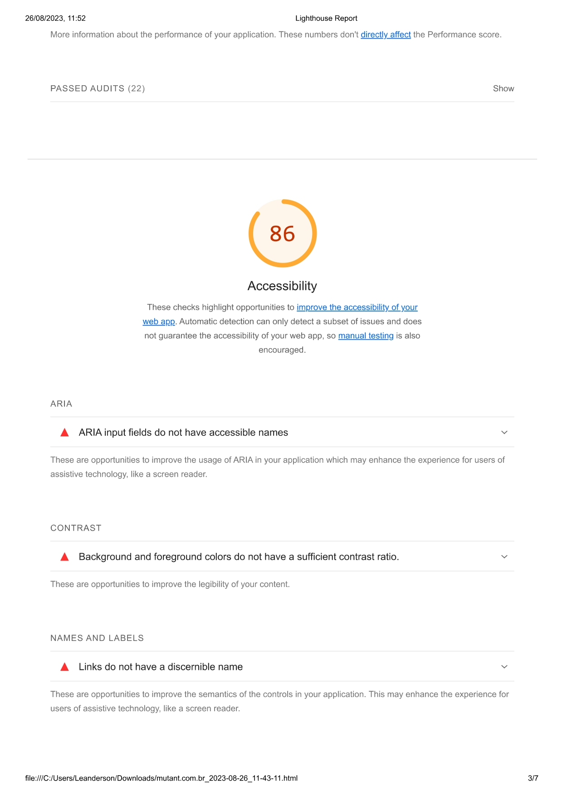
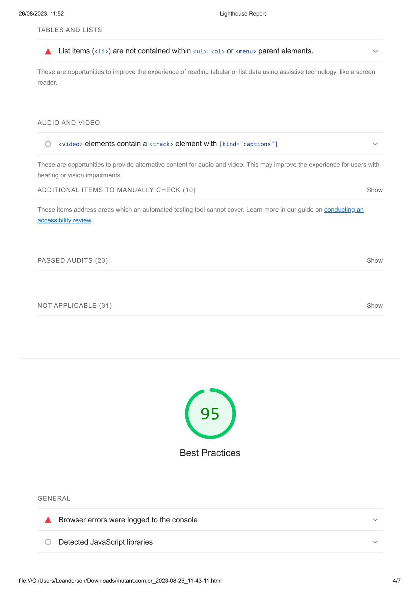
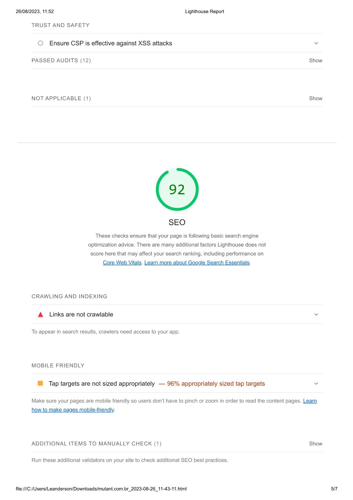
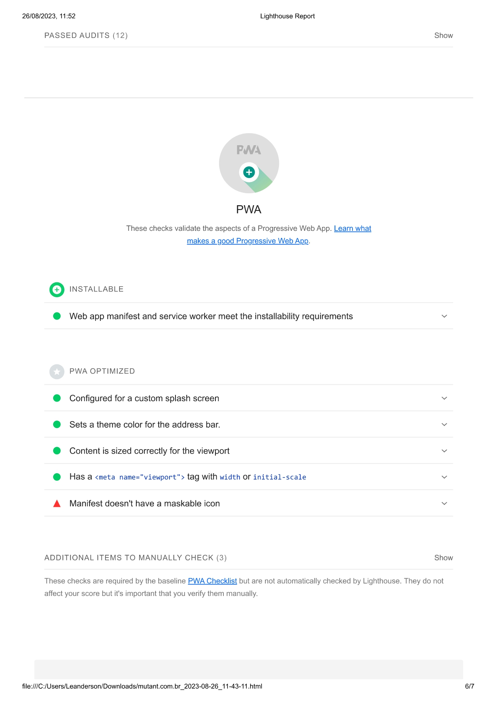
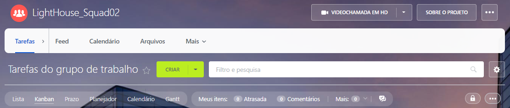
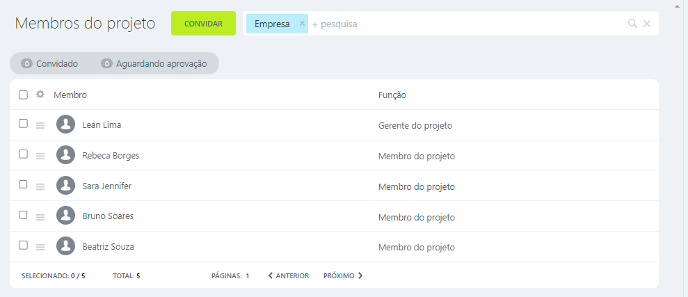
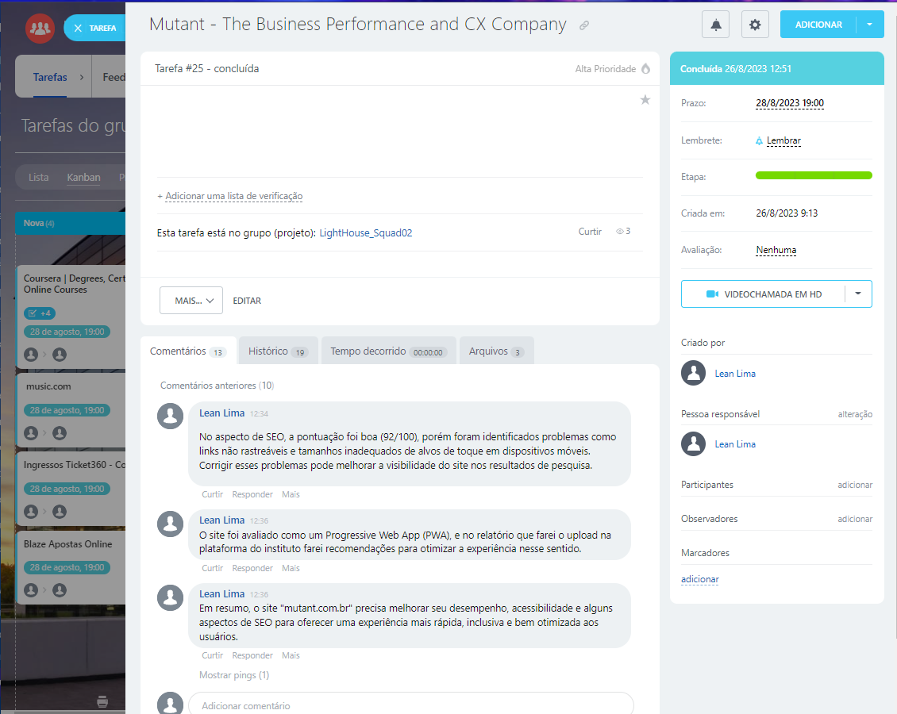

# Atividades do Módulo 3 - QA NA PRÁTICA 📚

Esse [repositório](https://github.com/LeanDevLima/Squad02_M3) é dedicado às atividades realizadas durante o Módulo 3 - QA NA PRÁTICA do curso de Quality Assurance oferecido pelo [**Instituto JogaJunto**](https://www.jogajuntoinstituto.org/). 

 
🚀 Descrição da 13ª Atividade: 🌟

 

🔍Dividam-se nos respectivos squads. Analisem 4 sites diferentes no LightHouse e criem um report sobre os dados obtidos. Criem uma tarefa no Bitrix para cada site e inclua todas as informações importantes, como valores, imagens, horário de teste, tipo de dispositivo utilizado e opções para melhorias. Exportem o pdf do Lighthouse, compile os quatro em um único arquivo e façam upload aqui na plataforma para correção dos facilitadores.

 - A seguir, apresento um resumo das discussões em grupo, complementado por minhas contribuições adicionais:

Para essa atividade é necessário a instalação da extensão [Lighthouse]([LightHouse.png](https://chrome.google.com/webstore/detail/lighthouse/blipmdconlkpinefehnmjammfjpmpbjk?gclid=CjwKCAjwxaanBhBQEiwA84TVXELSxabzgZxcAEpsC2w3vZ3FjxHr49SDzYp_WUybmJuwpE6KQd1bLBoCaSgQAvD_BwE)).

E cadastro na plataforma [Bitrix](https://www.bitrix24.com.br/).

Cada integrante da squad excolheu um site para execução da tarefa, o site escolhido por mim foi o site da empresa [Mutant](https://mutant.com.br/) https://mutant.com.br/.

### Abaixo segue o relatório extraído do Lighthouse. 

---

---

---

---

---

---

---

### Projeto LightHouse_Squad02 - Bitrix

Aqui apresento alguns detalhes do projeto realizado pela nossa squad na plataforma Bitrix.

#### Projeto:

#### Integrantes da Squad:

#### Tarefa:

 Obs: Cada membro da Squad possui sua própria tarefa designada de acordo com a seleção do site escolhido para análise.

---
Caso você queira conferir o projeto direto na plataforma Bitrix, disponibilizo aqui o convite para o nosso projeto. ► [Clique Aqui!](https://b24-xb925c.bitrix24.com.br/?secret=urdjjj1l) ◄ 

---

### Resultados e Sugestões de Melhoria

A seguir, apresento uma breve descrição dos resultados, juntamente com minhas observações em relação às análises realizadas pelo Lighthouse.

#### Resultados Obtidos:

- **Performance (19/100):** O desempenho é baixo, com métricas de carregamento indicando lentidão.
- **Acessibilidade (86/100):** Boa pontuação, mas oportunidades para melhorias no uso de ARIA e legibilidade.
- **Melhores Práticas (95/100):** Pontuação alta, mas pequenos erros de JavaScript foram registrados.
- **SEO (92/100):** Pontuação razoável, com problemas de links rastreáveis e tamanhos de alvos de toque.

### Sugestões de Melhorias:

#### Desempenho:

- Reduza o uso de JavaScript não utilizado.
- Elimine recursos que bloqueiam a renderização inicial.
- Adie o carregamento de imagens fora da tela.
- Minimize o trabalho na thread principal.
- Otimize o cache de ativos estáticos.
- Reduza o tempo de execução do JavaScript.

#### Acessibilidade:

- Forneça nomes acessíveis para campos de entrada ARIA.
- Garanta contraste adequado entre cores.
- Certifique-se de que links tenham nomes discerníveis.
- Organize listas dentro de elementos apropriados.

#### Melhores Práticas:

- Resolva erros de JavaScript no console.
- Otimize a Política de Segurança de Conteúdo (CSP).

#### SEO:

- Torne links rastreáveis.
- Ajuste tamanhos de alvos de toque para dispositivos móveis.

#### PWA:

- Verifique e corrija questões para melhorar a experiência.

Essas melhorias podem otimizar o desempenho, acessibilidade, práticas recomendadas e otimização para mecanismos de busca do site "mutant.com.br".

## Integrantes da Squad:

| Beatriz Souza  | [Bruno Soares](https://www.linkedin.com/in/bruno-soaresdev/)  | [Leanderson Lima](https://www.linkedin.com/in/leanderson-dias-de-lima/) | [Rebeca Borges](https://www.linkedin.com/in/rebecaborgess/) | Sara Cruz | 