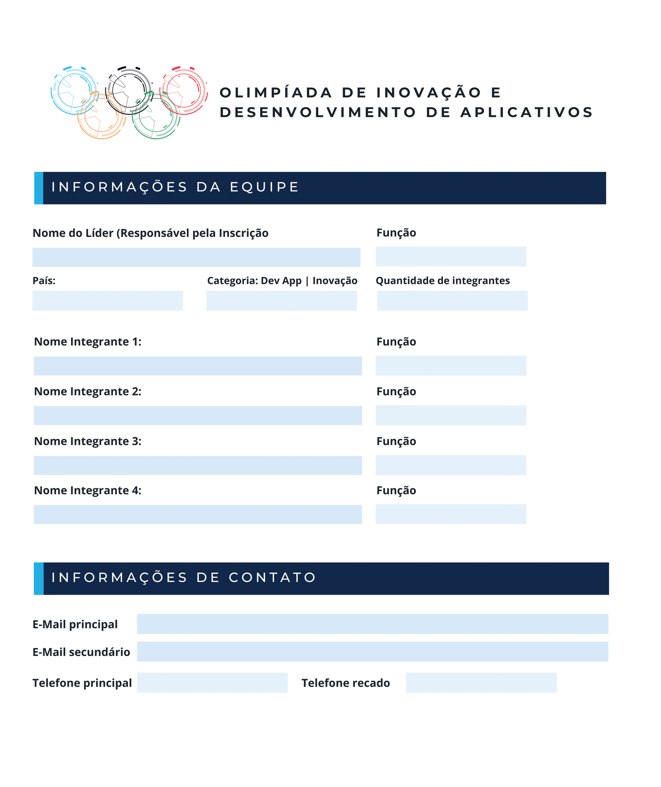
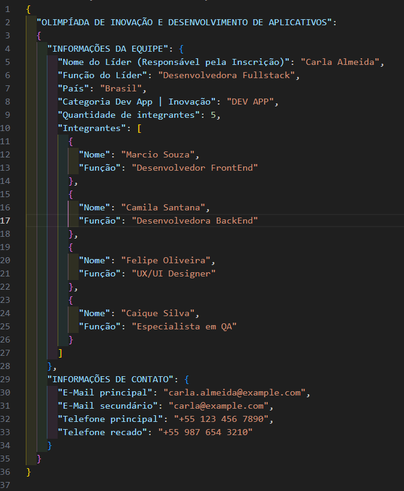
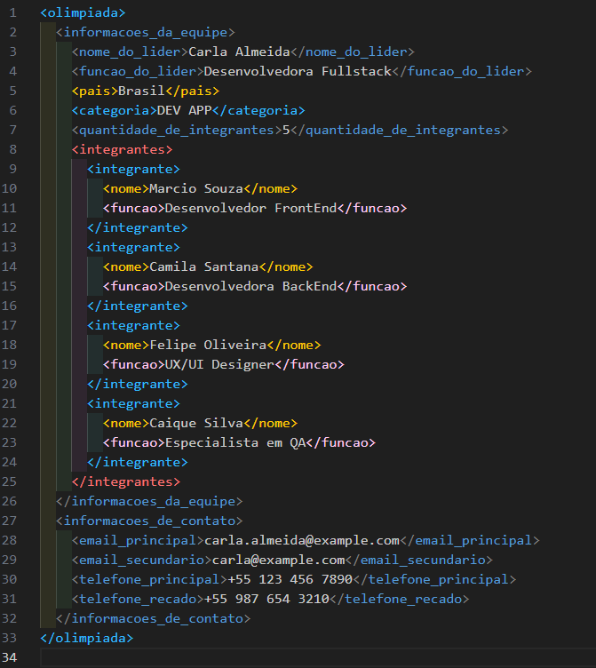

# Atividades do Módulo 3 - QA NA PRÁTICA 📚

Esse [repositório](https://github.com/LeanDevLima/Squad02_M3) é dedicado às atividades realizadas durante o Módulo 3 - QA NA PRÁTICA do curso de Quality Assurance oferecido pelo [**Instituto JogaJunto**](https://www.jogajuntoinstituto.org/). 

 
🚀 Descrição da 14ª Atividade: 🌟

 

🔍Passo a passo para o desafio. Reunam-se em seus SQUADs. Metade dos SQUADs ta turma serão responsáveis pela estrutura XML e a outra metade pela estrutura JSON. Os SQUADs responsáveis pelo JSON devem, a partir da estrutura do formulário e das informações disponibilizadas no case, criar um arquivo na estrutura JSON. Os SQUADs responsáveis pelo XML devem, a partir da estrutura do formulário e das informações disponibilizadas no case, criar um arquivo na estrutura XML. 

- A Squad a qual eu faço parte ficou responsápel por criar um arquivo Json, porém, com propósito de agregar conhecimento, fiz a atividade com os dois parâmetros solicitados (Json e XML). Os arquivos correspondentes estão na pasta "Atividades" deste repositório. Segue abaixo o resultado:

### JSON

---

### XML

## Integrantes da Squad:

| Beatriz Souza  | [Bruno Soares](https://www.linkedin.com/in/bruno-soaresdev/)  | [Leanderson Lima](https://www.linkedin.com/in/leanderson-dias-de-lima/) | [Rebeca Borges](https://www.linkedin.com/in/rebecaborgess/) | Sara Cruz | 