# Atividades do Módulo 3 - QA NA PRÁTICA 📚

Esse [repositório](https://github.com/LeanDevLima/Squad02_M3) é dedicado às atividades realizadas durante o Módulo 3 - QA NA PRÁTICA do curso de Quality Assurance oferecido pelo [**Instituto JogaJunto**](https://www.jogajuntoinstituto.org/). 

<br>
🚀 Descrição da 14ª Atividade: 🌟

<br>

🔍 Em SQUAD, faça o seguinte teste: A BIBLIOTECA DA CIDADE está criando um sistema para cadastro de filmes, e querem testar uma API que será usada pelas instituições parceiras para cadastro de livros. Seu SQUAD foi escolhido para realizar esse teste.

1 - Pegue todos os endpoints existentes na documentação do sistema.

2 - Cadastre 4 livros com as seguintes informações em um json: Título, Autor, Gênero e Edição.

3 - Faça requisições GET em todos os livros e veja se os cadastrados por você estão disponíveis.

4 - Adicione o teste a seguir: pm.test("Status code in 200", function(){pm.response.to.have.status(200);});

- Uma das coisas que achei interessante sobre essa atividade é que tanto colegas da minha própria equipe quanto membros de outras equipes me procuraram para pedir ajuda na sua realização. Fiquei muito feliz por poder contribuir e auxiliar diversas pessoas nesse processo. Com a intenção de compartilhar essa ajuda com o maior número possível de indivíduos, decidi disponibilizar a resolução da atividade abaixo no formato de um "tutorial".


#### Certifique-se de ter o Postman instalado em seu computador. Se você ainda não tem o Postman, você pode baixá-lo e instalá-lo a partir do [site oficial](https://www.postman.com/).


### Preparando o Postman:

Anteriormente, busquei explicar de maneira didática. Nesta seção bônus, irei demonstrar a execução da atividade, além de compartilhar alguns atalhos que simplificaram o processo:

1. Criação das requisições (GET, POST, PUT, PATCH, DELETE)
 
 Ao invés de criar as requisições manualmente, o POSTMAN permite que você importe todas as requisições que já estão criadas na API através do link do Swagger.


---
Clique no 'Menu' que fica no canto superior esquerdo representado pelo símbolo ≡. Em seguida File e depois Import... 

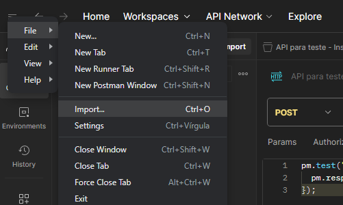

---
Copie e cole a [URL da API](http://apilivro.jogajuntoinstituto.org:8000/swagger/) no campo designado.

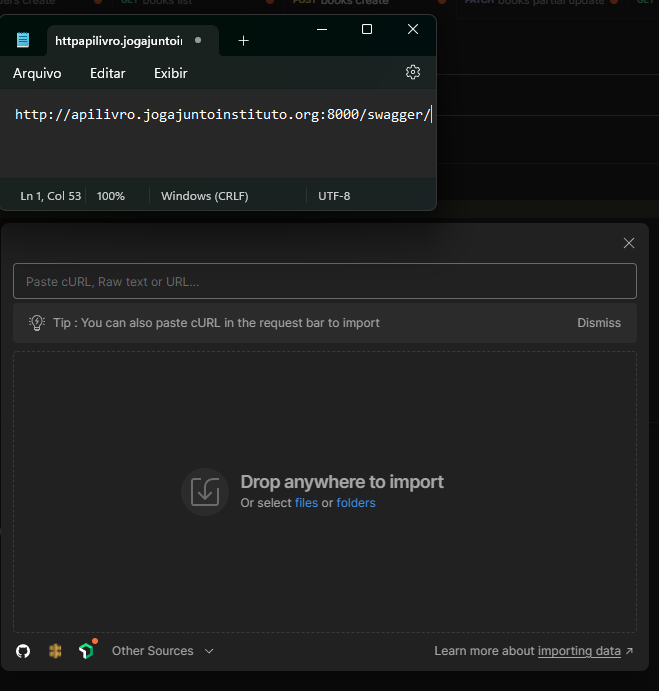

---
Escolha a primeira opção.

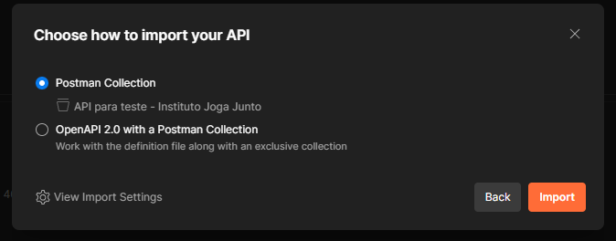

---
Após o carregamento você terá toda a estrutura da API pronta para uso.

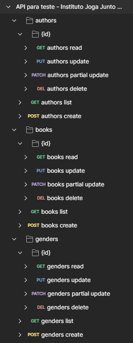

---

A URL da API é automaticamente transformada e uma variável chamada "baseUrl".

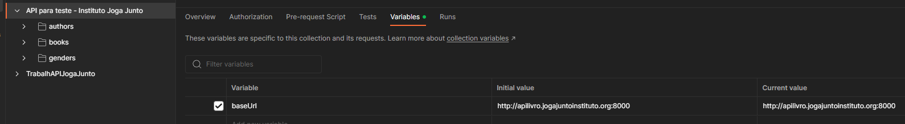

---

Para evitar possíveis erros de autenticação, recomendo deixar a opção "No Auth" para executar os passos seguintes.

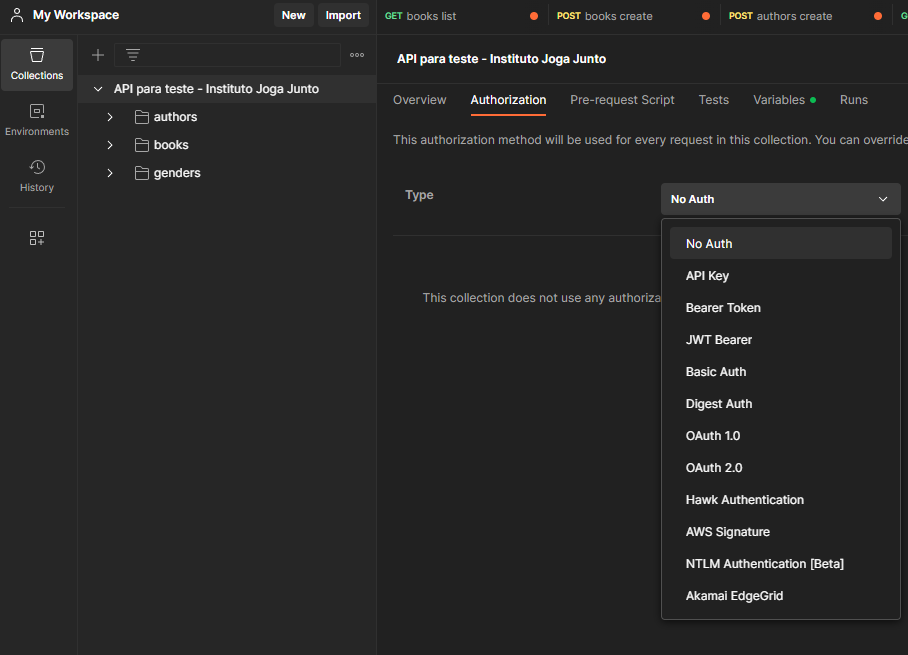

---


### Executanto a atividade:

1. A primeira etapa da atividade consistem em obter todos os endpoints existentes na documentação do sistema.

Um endpoint em uma API é um ponto de acesso específico que permite que os clientes façam solicitações e interajam com o sistema ou serviço. Geralmente, um endpoint é identificado por uma URL única e corresponde a uma ação ou recurso específico que a API oferece.

Cada endpoint é associado a um método HTTP, como GET, POST, PUT, PATCH ou DELETE, que determina a ação que será executada sobre os dados. Os endpoints definem como os recursos da API podem ser acessados e manipulados, permitindo que os clientes realizem operações como obter informações, enviar dados, atualizar, criar ou excluir recursos.

Nesse contexto os endpoints são representados por cada seção que descreve as diferentes operações que podem ser realizadas na API para teste - Instituto Joga Junto v1 , como listar autores, criar livros, obter detalhes de gêneros, entre outros. Cada endpoint possui uma URL única e um método HTTP associado que permite aos usuários interagir com as funcionalidades oferecidas pela API.

Para facilitar a compreenção vou manter a variável <u>"baseUrl"</u> , lembrando que seu conteúdo é http://apilivro.jogajuntoinstituto.org:8000.


#### Autores (Authors) ✍️

- **Listagem de Autores** 🔍
  - Método: GET
  - Endpoint: {{baseUrl}}/authors/

- **Criação de Autor** ➕
  - Método: POST
  - Endpoint: {{baseUrl}}/authors/

- **Detalhes de Autor** 🔍
  - Método: GET
  - Endpoint: {{baseUrl}}/authors/:id/

- **Atualização de Autor** ✏️
  - Método: PUT
  - Endpoint: {{baseUrl}}/authors/:id/`

- **Atualização Parcial de Autor** ✏️
  - Método: PATCH
  - Endpoint: {{baseUrl}}/authors/:id/

- **Exclusão de Autor** ❌
  - Método: DELETE
  - Endpoint: `{{baseUrl}}/authors/:id/

#### Livros (Books) 📚

- **Listagem de Livros** 🔍
  - Método: GET
  - Endpoint: {{baseUrl}}/books

- **Criação de Livro** ➕
  - Método: POST
  - Endpoint: {{baseUrl}}/books/

- **Detalhes de Livro** 🔍
  - Método: GET
  - Endpoint: {{baseUrl}}/books

- **Atualização de Livro** ✏️
  - Método: PUT
  - Endpoint: {{baseUrl}}/books/:id/

- **Atualização Parcial de Livro** ✏️
  - Método: PATCH
  - Endpoint: {{baseUrl}}/books/:id/

- **Exclusão de Livro** ❌
  - Método: DELETE
  - Endpoint: {{baseUrl}}/books/:id/

#### Gêneros (Genders) 🔖

- **Listagem de Gêneros** 🔍
  - Método: GET
  - Endpoint: {{baseUrl}}/genders/

- **Criação de Gênero** ➕
  - Método: POST
  - Endpoint: {{baseUrl}}/genders/

- **Detalhes de Gênero** 🔍
  - Método: GET
  - Endpoint: {{baseUrl}}/genders/:id/

- **Atualização de Gênero** ✏️
  - Método: PUT
  - Endpoint: {{baseUrl}}/genders/:id/

- **Atualização Parcial de Gênero** ✏️
  - Método: PATCH
  - Endpoint: {{baseUrl}}/genders/:id/

- **Exclusão de Gênero** ❌
  - Método: DELETE
  - Endpoint: {{baseUrl}}/genders/:id/


---


2. A próxima etapa da atividade consiste em cadastrar 4 livros, deve-se entender primeiro os requisitos necessários para que um livro seja criado. Essa informação podemos encontrar no próprio Swagger:

#### OBS: sempre que abrir uma seção no Swagger cliente em 'Try it Out' no canto superior da seção ou 'Cancel' seguido de 'Try it Out' para conseguir visualizar as informações conforme as imagens abaixo.

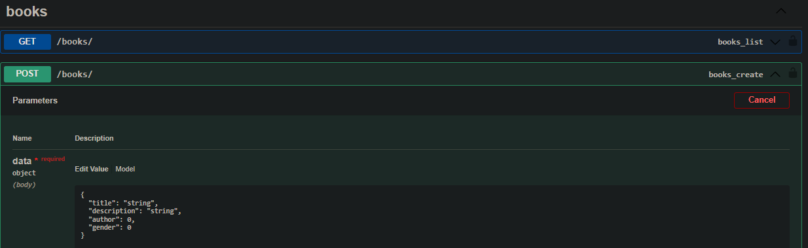

Perceba que para dar um comando POST, ou seja, para cadastrar um livro é necessário ter o ID de um "author" e de um "gender". O que significa que devemos cadastra-los primeiro.

 - Requisitos para cadastrar um "author":
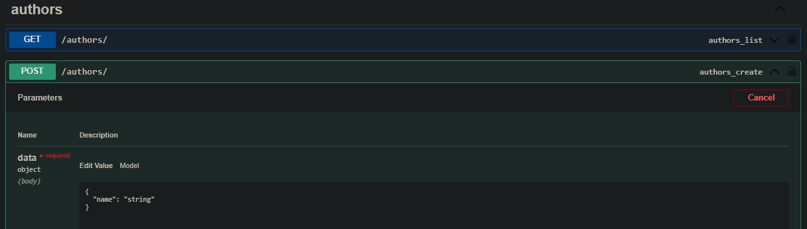

- Requisitos para cadastrar um "gender":


Após entendido o que é necesspario para cada, vamos visualizar isso no POSTMAN:

- Criando um "author":

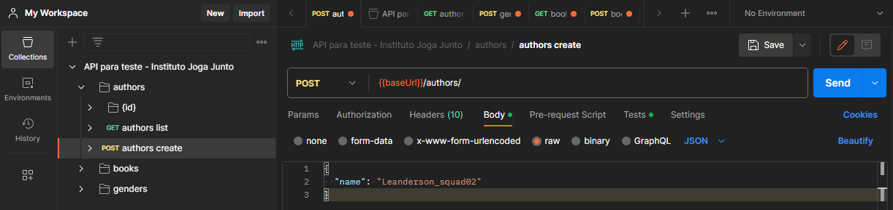
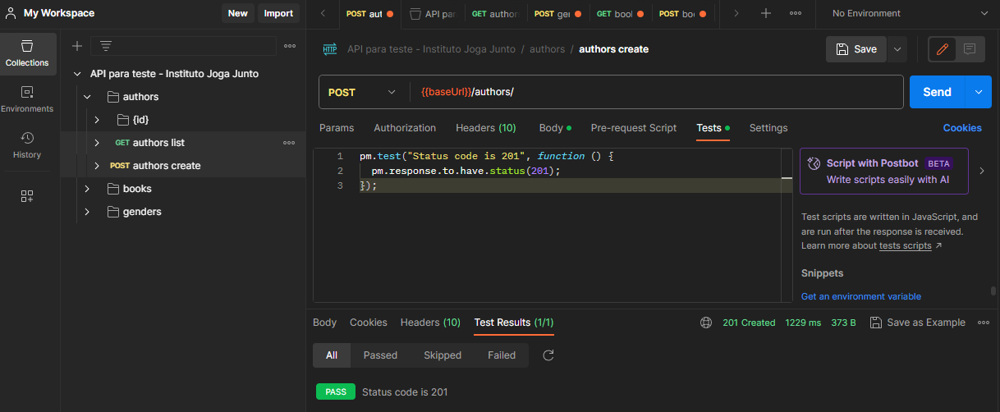

- Criando um "gender":

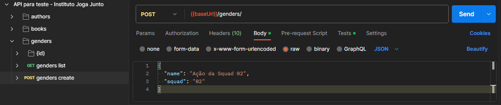
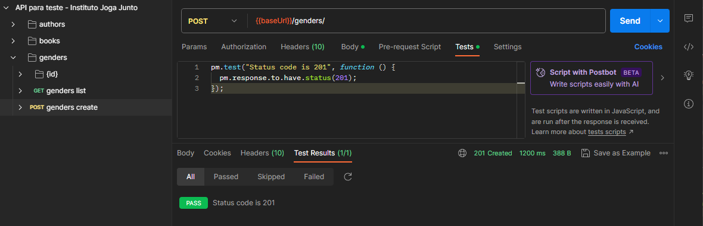


Após termos o author e o gender criados podemos por fim criar os livros:

obs: O IDs de "author" e "gender" vão aparecer no campo "Response" assim que forem criados.


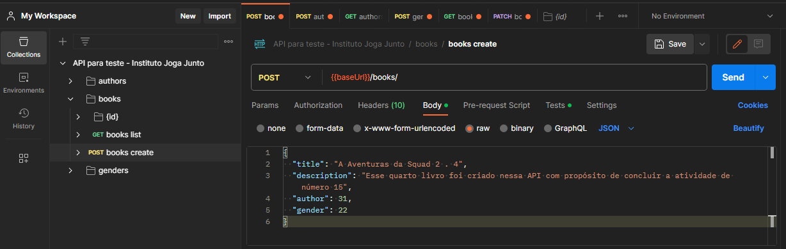


obs: Aqui você tem a opção de criar 1 por 1, ou os 4 livros de uma vez.

---

3. Dando um GET em "books" podemos confirmar que os livros já foram criados(essa já é a terceira etapa da atividade):

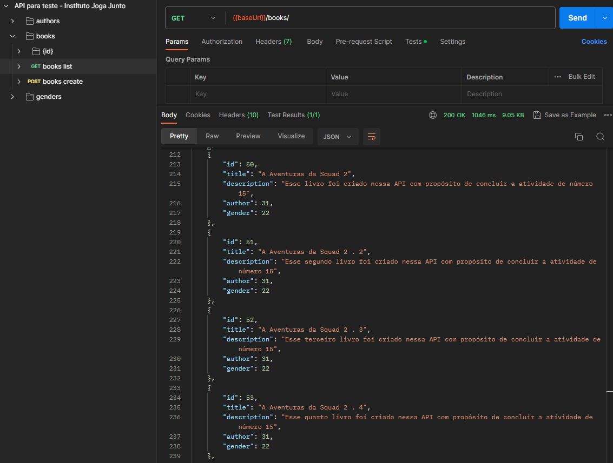

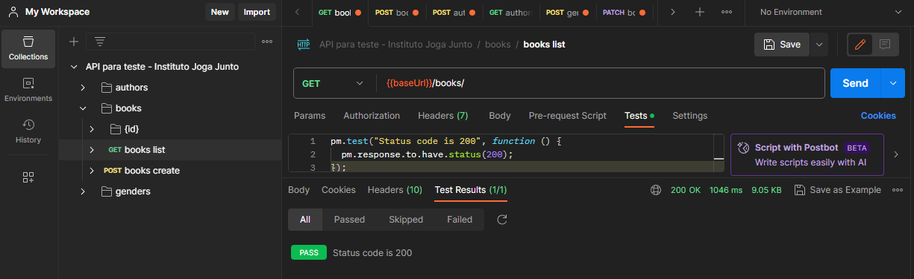

---

4. A ultima etapa dessa atividade pede para adicionar o teste a seguir: -► pm.test("Status code in 200", function(){pm.response.to.have.status(200);}); ◄-

Nos prints anteriores percebe-se que essa perte já foi feita, portanto vou usar esse espaço para dar as referências de onde você pode consultar informações relacionadas.

O primeiro é a documentação do Postman tratando sobre scripts de teste:

https://learning.postman.com/docs/writing-scripts/script-references/test-examples/

Para o caso de um GET:
```javascript

pm.test("Status code is 200", function () {
  pm.response.to.have.status(200);
});

```

Para o caso de um POST:
```javascript

pm.test("Status code is 201", function () {
  pm.response.to.have.status(201);
});

```

Como eu sei onde o código de resposta é 200 ou 201? 
Os códigos de respostas HHTP seguem sempre o mesmo padrão, você pode encontrar vários exemplos aqui: https://developer.mozilla.org/en-US/docs/Web/HTTP/Status

Abaixo são os que foram mais usados nessa atividade:
 
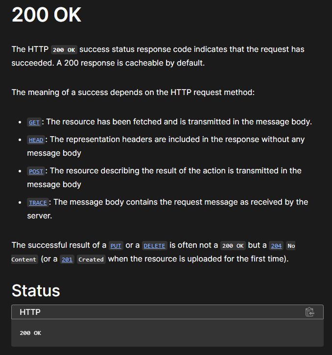

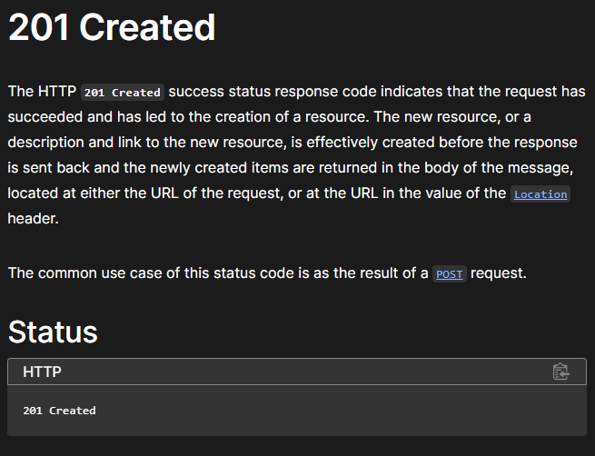

Eu espero que esse repositório te ajude não só a entregar a atividade, mas também a entender como as coisas foram feitas e como elas funcionam.

## Integrantes da Squad:

| Beatriz Souza  | [Bruno Soares](https://www.linkedin.com/in/bruno-soaresdev/)  | [Leanderson Lima](https://www.linkedin.com/in/leanderson-dias-de-lima/) | [Rebeca Borges](https://www.linkedin.com/in/rebecaborgess/) | Sara Cruz | 