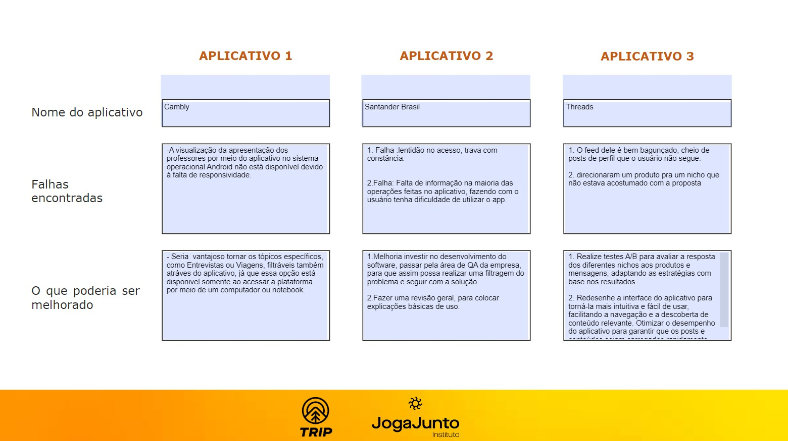
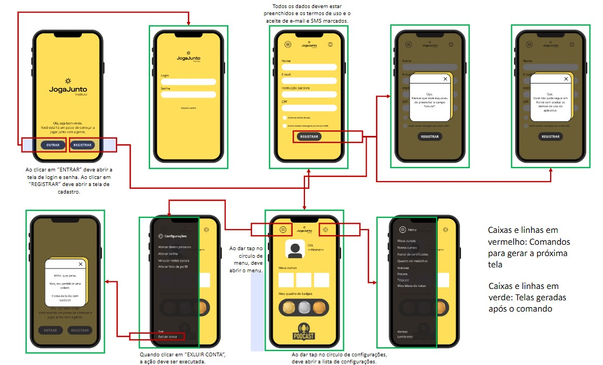
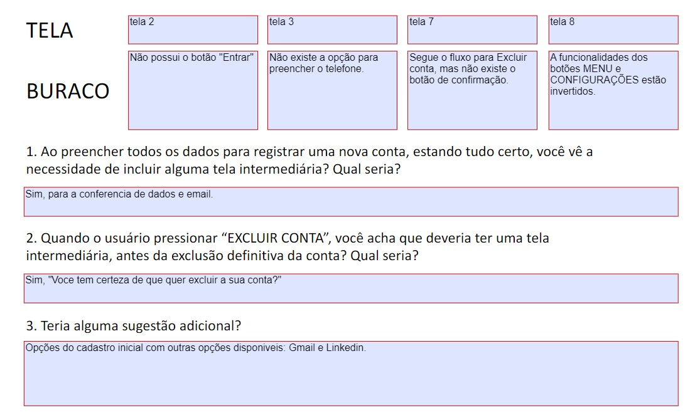

# Atividades do Módulo 3 - QA NA PRÁTICA 📚

Esse [repositório](https://github.com/LeanDevLima/Squad02_M3) é dedicado às atividades realizadas durante o Módulo 3 - QA NA PRÁTICA do curso de Quality Assurance oferecido pelo [**Instituto JogaJunto**](https://www.jogajuntoinstituto.org/). 

Clique nas "►" abaixo para visualizar os conteúdos trabalhados nesse módulo. Para recolher o conteúdo, basta clicar nas "▼" novamente. 😁

Profissa de Qualidade: 🌟

🚀 Descrição da 1ª Atividade: 🌟

 

🔍 Responda a pergunta: O que vocês acham que um aplicativo, site ou software precisa ter para ser um sucesso? Listem, no mínimo, 4 características.

 - A seguir, apresento um resumo das discussões em grupo, complementado por minhas contribuições adicionais:

1. **Usabilidade Intuitiva**: A facilidade de uso é fundamental. Um aplicativo ou software deve ser intuitivo, com uma interface de usuário clara e fácil de entender. Quanto mais rápido os usuários conseguirem entender como usar o sistema, mais provável será que eles continuem a usá-lo.

2. **Solução de Problema**: Um aplicativo de sucesso geralmente resolve um problema real para os usuários. Se ele puder oferecer uma solução eficaz e atender às necessidades dos usuários de maneira melhor ou mais eficiente do que as alternativas existentes, terá uma vantagem competitiva.

3. **Desempenho e Confiabilidade**: Os usuários esperam que um aplicativo funcione sem problemas e de maneira consistente. Problemas de desempenho, lentidão ou falhas frequentes podem levar à frustração dos usuários e à perda de confiança no software.

4. **Valor Agregado e Inovação**: Um aplicativo bem-sucedido muitas vezes oferece algo único ou inovador. Se ele puder fornecer um valor único para os usuários, seja por meio de recursos exclusivos, experiências personalizadas ou funcionalidades inovadoras, é mais provável que atraia e retenha um público fiel.

Essas são apenas algumas características importantes, e o sucesso de um aplicativo, site ou software também pode depender de outros fatores, como estratégias de marketing eficazes, suporte ao cliente sólido e adaptação às necessidades em constante evolução dos usuários.

🚀 Descrição da 2ª Atividade: 🌟

 

🔍 Responda a pergunta: Quais características são essenciais para profissionais de QA? Tentem fazer duas listas de características. Uma com a percepção de vocês e outra com base nas pesquisas feitas na internet.

 - A seguir, apresento um resumo das discussões em grupo, complementado por minhas contribuições adicionais:

### Com base na nossa Percepção:

1. **Atenção aos Detalhes:** Profissionais de QA devem ser extremamente detalhistas para identificar até os erros mais sutis nos produtos ou sistemas em teste.

2. **Comunicação Eficaz:** Uma comunicação clara e eficaz é fundamental para relatar bugs e problemas aos desenvolvedores e outros membros da equipe.

3. **Pensamento Analítico:** A capacidade de analisar sistemas complexos, identificar padrões e antecipar possíveis problemas é essencial para um QA.

4. **Conhecimento Técnico:** Compreender os fundamentos técnicos por trás do software e das tecnologias envolvidas ajuda os profissionais de QA a testar com mais eficiência.

5. **Capacidade de Automatização:** A automação de testes é cada vez mais importante. Saber criar e manter scripts de teste automatizados é uma habilidade valiosa.

6. **Flexibilidade:** Os requisitos e o contexto dos projetos de software podem mudar rapidamente. Ser flexível e capaz de se adaptar a essas mudanças é crucial.

7. **Conhecimento do Domínio:** Entender o setor ou a área em que o software será usado ajuda a direcionar os testes para cenários relevantes.

8. **Trabalho em Equipe:** Colaboração eficaz com desenvolvedores e outros membros da equipe.

9. **Resolução de Problemas:** Habilidade em encontrar soluções para desafios complexos de teste.

10. **Foco no Usuário Final:** Garantir que o software atenda às necessidades e expectativas dos usuários.

### Com base em Pesquisas na Internet:

1. **Habilidade Técnica:** Profissionais de QA devem ter conhecimentos técnicos sólidos para entender as aplicações e sistemas que estão testando.

2. **Experiência em Ferramentas de Teste:** Familiaridade com ferramentas de automação, rastreamento de problemas e gerenciamento de testes é essencial.

3. **Compreensão do Processo de Desenvolvimento:** Saber como o desenvolvimento de software ocorre ajuda os QAs a se integrarem melhor às equipes de desenvolvimento.

4. **Capacidade de Documentação:** Documentar meticulosamente os testes realizados e os resultados obtidos é importante para rastrear o progresso e compartilhar informações.

5. **Colaboração Eficiente:** Trabalhar bem em equipe é crucial, já que os QAs precisam coordenar-se com desenvolvedores, gerentes de projeto e outros membros.

6. **Testes Exploratórios:** A capacidade de explorar o software em busca de problemas não óbvios é uma habilidade altamente valorizada.

7. **Conhecimento de Metodologias Ágeis:** Muitas equipes de desenvolvimento adotam metodologias ágeis. O entendimento dessas práticas é útil para QAs.

8. **Acompanhamento de Tendências:** Manter-se atualizado com as últimas tendências em testes e tecnologia.

9. **Gestão de Tempo:** Eficiência na organização de tarefas e priorização de testes.

10. **Mentalidade de Qualidade:** Buscar constantemente a excelência na entrega de software de alta qualidade.

*Lembrando que diferentes empresas e contextos podem valorizar diferentes conjuntos de características, mas essas listas oferecem uma ideia geral das habilidades e conhecimentos necessários para profissionais de QA.*

🚀 Descrição da 3ª Atividade: 🌟

 

🔍 Responda a pergunta: Pesquisem o que é e qual a importância de UX - USER EXPERIENCE, WIREFRAME e COPYWRITING.

 - A seguir, apresento um resumo das discussões em grupo, complementado por minhas contribuições adicionais:

### UX - User Experience (Experiência do Usuário):

**Definição:** A Experiência do Usuário engloba a qualidade geral da interação de um usuário com um produto ou serviço.

**Importância:** Influencia a satisfação, a fidelidade e a eficácia do produto, impactando diretamente a percepção e ação dos usuários.

### Wireframe (Esboço de Estrutura):

**Definição:** Um wireframe é um esboço visual que representa a estrutura básica e a disposição dos elementos em um design interativo.

**Importância:** Proporciona um guia visual inicial para a organização do layout, facilitando a comunicação entre a equipe de design e desenvolvimento.

### Copywriting (Redação Publicitária):

**Definição:** Copywriting é a criação de textos persuasivos para marketing e publicidade, com o objetivo de inspirar ação.

**Importância:** Influi na persuasão, engajamento e conversões, capacitando a comunicação eficaz de mensagens de marketing para o público-alvo.

🚀 Descrição da 4ª Atividade: 🌟

 

🔍 Responda a pergunta: Pesquisem os principais tipos de testes realizados por QA e o que é feito em cada teste. 

 - A seguir, apresento um resumo das discussões em grupo, complementado por minhas contribuições adicionais:

Testes de QA englobam uma variedade de abordagens para verificar a qualidade do software em diferentes níveis. Aqui estão os principais tipos e suas descrições sucintas:

### Testes Unitários:

- **O que é feito:** Testa unidades individuais de código, como funções ou métodos, isoladamente.
- **Objetivo:** Identificar erros em componentes de código pequenos e específicos.

### Testes de Integração:

- **O que é feito:** Verifica a interação entre módulos ou componentes do software.
- **Objetivo:** Detectar problemas de comunicação e colaboração entre diferentes partes do sistema.

### Testes Funcionais:

- **O que é feito:** Avalia as funcionalidades do software, geralmente usando cenários reais de uso.
- **Objetivo:** Verificar se o software se comporta conforme esperado e atende aos requisitos.

### Testes de Aceitação:

- **O que é feito:** Valida se o software está pronto para ser entregue ao cliente, com base nos critérios de aceitação.
- **Objetivo:** Garantir que o software atenda aos padrões e às expectativas do cliente.

### Testes de Desempenho:

- **O que é feito:** Avalia a resposta do sistema sob diferentes condições de carga e estresse.
- **Objetivo:** Identificar gargalos de desempenho e otimizar o software para um melhor rendimento.

### Testes de Segurança:

- **O que é feito:** Verifica vulnerabilidades e falhas de segurança do sistema.
- **Objetivo:** Proteger o software contra ameaças e ataques maliciosos.

### Testes de Usabilidade:

- **O que é feito:** Avalia a experiência do usuário e a facilidade de uso do software.
- **Objetivo:** Garantir que o software seja intuitivo e agradável para os usuários.

### Testes de Compatibilidade:

- **O que é feito:** Testa o software em diferentes dispositivos, navegadores ou ambientes.
- **Objetivo:** Assegurar que o software funcione corretamente em diversas plataformas.

### Testes de Regressão:

- **O que é feito:** Reexecuta testes anteriores para verificar se novas alterações causaram regressões.
- **Objetivo:** Garantir que mudanças recentes não afetem áreas previamente testadas.

### Testes de Aceitação do Usuário (UAT):

- **O que é feito:** Testes finais conduzidos pelo cliente ou usuário final.
- **Objetivo:** Confirmar que o software atende às expectativas do usuário antes da implantação.

Cada tipo de teste desempenha um papel importante na identificação de diferentes tipos de problemas no software e na garantia de sua qualidade global.

🚀 Descrição da 5ª Atividade: 🌟

 
🔍 Responda a pergunta: Escolha três aplicativos que já possua em seu celular. Explore os três aplicativos. Liste: possíveis falhas encontradas > elementos que poderiam ser mudados ou acrescentados para melhorar o aplicativo

 - Para essa atividade cada integrante da Squad escolheu um app que já possuia mais intimidade. No meu caso eu ecolhi o Cambly que adquiri recentemente com o propósito de melhorar minha conversação no idioma Inglês. Os outros campos foram preenchidos pelos meus colegas da squad.

Tá Bugado: 🌟

🚀 Descrição da 6ª Atividade: 🌟

 
🔍 Responda a pergunta: Baixem o material a seguir, analisem e identifiquem se há buracos. Caso encontrem algum indício de buraco, descrevam o motivo.

🚀 Descrição da 7ª Atividade: 🌟

 
🔍 Responda a pergunta: Faça uma pesquisa na internet e defina: o que é o teste de caixa branca e caixa preta. Como esses testes são feitos e quem geralmente executa?

### Teste de Caixa Branca (White Box):

O teste de caixa branca é um método de teste de software que se concentra na avaliação dos aspectos internos do código-fonte de um programa ou sistema. Nesse tipo de teste, o testador possui conhecimento detalhado sobre a estrutura interna, o código e a lógica do software. O objetivo principal é verificar a funcionalidade do software, garantir que todas as condições e caminhos possíveis do código sejam testados e identificar potenciais falhas de lógica ou erros de programação.

Os testes de caixa branca envolvem a criação de casos de teste com base na análise do código-fonte, dos fluxos de controle e das estruturas de dados utilizadas no programa. Esses testes podem incluir a execução de todos os ramos de código, a verificação de limites, a análise de loops e a avaliação de tomadas de decisão. Os testadores que executam testes de caixa branca geralmente possuem conhecimento técnico e habilidades de programação para entender o código subjacente.

### Teste de Caixa Preta (Black Box):

O teste de caixa preta é um método de teste de software que se concentra na avaliação das funcionalidades e comportamentos visíveis de um programa, sem a necessidade de entender sua estrutura interna ou código-fonte. Nesse tipo de teste, o testador não tem conhecimento detalhado sobre como o software foi implementado, mas está preocupado em validar se ele atende aos requisitos especificados e se produz os resultados esperados.

Os testes de caixa preta envolvem a criação de casos de teste com base nas especificações, nos requisitos do sistema e nas funcionalidades descritas. Os testes são conduzidos sem acesso ao código-fonte e se concentram em verificar a entrada e a saída do software, bem como o comportamento em diferentes condições de entrada. Os testadores que executam testes de caixa preta geralmente têm um entendimento do domínio do software, mas não precisam ser programadores.

### Análise Estática e Dinâmica:

A análise estática utiliza a abordagem de caixa branca, também conhecida como caixa de vidro, na qual o código-fonte é alvo de análise. Esse tipo de análise é geralmente conduzido pela própria equipe de programação, pois envolve examinar o código como um elemento estático em busca de possíveis problemas, como erros de sintaxe, más práticas de programação e potenciais falhas de segurança.

Por outro lado, a análise dinâmica adota a abordagem de caixa preta. Nesse caso, a análise não está focada no código-fonte em si, mas sim na interface e no comportamento do software durante a sua execução. Normalmente, a equipe de qualidade é responsável por executar comandos no software e explorar seus recursos para verificar se todos os requisitos funcionais estão sendo atendidos corretamente. Isso envolve verificar se as funcionalidades estão se comportando como esperado e se o software está produzindo os resultados desejados.

## Quem Geralmente Executa Esses Testes:

Os testes de caixa branca e caixa preta são geralmente realizados por equipes de teste de software, que podem incluir engenheiros de teste, analistas de qualidade, testadores de garantia de qualidade, entre outros profissionais especializados em verificar a funcionalidade e a integridade de sistemas e aplicativos. A escolha de qual abordagem de teste usar dependerá das necessidades específicas do projeto, dos objetivos do teste e do conhecimento disponível sobre o software.

Em suma, ambos os tipos de teste desempenham um papel crucial na garantia da qualidade do software, mas se diferenciam em suas abordagens e nos tipos de equipe que os executam. Enquanto os testes de caixa branca focam na análise interna do código, os testes de caixa preta se concentram nas funcionalidades visíveis do sistema.

UAUUU, temos um plano: 🌟

 

🚀 Descrição da 8ª Atividade: 🌟

 

🔍 ATIVIDADE: ESCREVENDO O CENÁRIO DE TESTE 
- Funcionalidade 1: Envio de áudio no WhatsApp; 
- Funcionalidade 2: Tirar uma selfie; 
 
Escreva os cenários de teste para as duas funcionalidades acima.
___

Inicialmente, desenvolvemos cenários de teste levando em conta nossas experiências pessoais ao executar as tarefas mencionadas.
___

### Funcionalidade 1: Enviar um Áudio no WhatsApp

**Cenário 1: Enviar um áudio bem-sucedido**
1. Abrir o aplicativo WhatsApp.
2. Selecionar um contato válido da lista de contatos.
3. Clicar no ícone de anexo para abrir o menu de opções.
4. Escolher a opção "Áudio".
5. Gravar um áudio de 15 segundos.
6. Clicar no botão de envio.
7. Verificar se o áudio é exibido na janela de chat correta.
8. Verificar se o relógio de entrega indica a hora correta de envio.

**Cenário 2: Cancelar gravação de áudio**
1. Abrir o aplicativo WhatsApp.
2. Selecionar um contato válido da lista de contatos.
3. Clicar no ícone de anexo e escolher "Áudio".
4. Iniciar a gravação, mas em seguida, cancelar antes de concluir.
5. Verificar se a gravação foi cancelada e não enviada ao contato.

**Cenário 3: Envio de áudio sem rede**
1. Desativar a conexão de rede (Wi-Fi e dados móveis).
2. Abrir o aplicativo WhatsApp.
3. Selecionar um contato válido da lista de contatos.
4. Tentar enviar um áudio.
5. Verificar se o aplicativo exibe uma mensagem de erro relacionada à falta de conexão de rede.

**Cenário 4: Envio de áudio com tamanho máximo**
1. Abrir o aplicativo WhatsApp.
2. Selecionar um contato válido da lista de contatos.
3. Clicar no ícone de anexo e escolher "Áudio".
4. Gravar um áudio que atinja o tamanho máximo permitido (por exemplo, 5 minutos).
5. Tentar enviar o áudio.
6. Verificar se o aplicativo valida e impede o envio de áudios maiores que o limite.

### Funcionalidade 2: Tirar uma Selfie

**Cenário 1: Tirar uma selfie bem-sucedida**
1. Abrir o aplicativo da câmera.
2. Verificar se a câmera frontal está ativada.
3. Clicar no botão de captura para tirar a selfie.
4. Verificar se a imagem é exibida na tela de visualização.
5. Salvar a selfie.
6. Verificar se a selfie é salva corretamente na galeria de fotos.

**Cenário 2: Trocar para câmera traseira**
1. Abrir o aplicativo da câmera.
2. Verificar se a câmera frontal está ativada por padrão.
3. Trocar para a câmera traseira usando o botão apropriado.
4. Clicar no botão de captura para tirar uma foto.
5. Verificar se a imagem é exibida na tela de visualização.
6. Salvar a foto.
7. Verificar se a foto tirada com a câmera traseira é salva corretamente.

**Cenário 3: Aplicar filtro à selfie**
1. Abrir o aplicativo da câmera.
2. Verificar se a câmera frontal está ativada.
3. Acessar as opções de filtro disponíveis.
4. Escolher um filtro para aplicar à selfie.
5. Clicar no botão de captura para tirar a selfie com o filtro.
6. Verificar se a imagem filtrada é exibida na tela de visualização.
7. Salvar a selfie filtrada.
8. Verificar se a selfie com o filtro é salva corretamente na galeria.

**Cenário 4: Cancelar tirar selfie**
1. Abrir o aplicativo da câmera.
2. Verificar se a câmera frontal está ativada.
3. Clicar no botão de cancelar ou sair antes de tirar a selfie.
4. Verificar se a câmera é fechada sem tirar a foto.

___

Após adquirirmos uma compreensão mais profunda dos princípios do Desenvolvimento Orientado a Comportamento (BDD), reestruturamos os cenários de teste de acordo com esses conceitos.
___

### Funcionalidade 1: Enviar um Áudio no WhatsApp

- **Cenário: Enviar um áudio bem-sucedido**

__Dado que:__ o aplicativo WhatsApp está aberto; E um contato válido da lista de contatos foi selecionado;

__Quando:__ o usuário clica no ícone de anexo e escolhe a opção "Áudio"; E grava um áudio de 15 segundos, E clica no botão de envio;

__Então:__ o áudio deve ser exibido na janela de chat correta; E o relógio de entrega deve indicar a hora correta de envio;

- **Cenário: Cancelar gravação de áudio**

__Dado que:__ o aplicativo WhatsApp está aberto; E um contato válido da lista de contatos foi selecionado;

__Quando:__ o usuário clica no ícone de anexo e escolhe "Áudio"; E inicia a gravação, mas em seguida, cancela antes de concluir;

__Então:__ a gravação não deve ser enviada ao contato;

- **Cenário: Envio de áudio sem rede**

__Dado que:__ a conexão de rede está desativada; E o aplicativo WhatsApp está aberto; E um contato válido da lista de contatos foi selecionado;

__Quando:__ o usuário tenta enviar um áudio;

__Então:__ o aplicativo deve exibir uma mensagem de erro relacionada à falta de conexão de rede;

- **Cenário: Envio de áudio com tamanho máximo**
  
__Dado que:__ o aplicativo WhatsApp está aberto; E um contato válido da lista de contatos foi selecionado;

__Quando:__ o usuário clica no ícone de anexo e escolhe "Áudio"; E grava um áudio que atinge o tamanho máximo permitido; E tenta enviar o áudio;

__Então:__ o aplicativo deve validar e impedir o envio de áudios maiores que o limite;

### Funcionalidade 2: Tirar uma Selfie

- **Cenário - Tirar uma selfie bem-sucedida**
  
__Dado que:__ o aplicativo da câmera está aberto; E a câmera frontal está ativada;

__Quando:__ o usuário clica no botão de captura;

__Então:__ a imagem da selfie deve ser exibida na tela de visualização; E a selfie deve ser salva corretamente na galeria de fotos;

- **Cenário - Trocar para câmera traseira**
  
__Dado que:__ o aplicativo da câmera está aberto; E a câmera frontal está ativada por padrão;

__Quando:__ o usuário troca para a câmera traseira usando o botão apropriado; E clica no botão de captura para tirar uma foto;

__Então:__ a imagem da foto deve ser exibida na tela de visualização; E a foto tirada com a câmera traseira deve ser salva corretamente;

- **Cenário - Aplicar filtro à selfie**

__Dado que:__ o aplicativo da câmera está aberto; E a câmera frontal está ativada;

__Quando:__ o usuário acessa as opções de filtro disponíveis; E escolhe um filtro para aplicar à selfie
E clica no botão de captura para tirar a selfie com o filtro;

__Então:__ a imagem da selfie filtrada deve ser exibida na tela de visualização; E a selfie com o filtro deve ser salva corretamente na galeria;

- **Cenário - Cancelar tirar selfie**
  
__Dado que:__ o aplicativo da câmera está aberto; E a câmera frontal está ativada;

__Quando:__ o usuário clica no botão de cancelar ou sair antes de tirar a selfie;

__Então:__ a câmera não deve tirar a foto;

🚀 Descrição da 9ª Atividade: 🌟

 
🔍 Faça uma pesquisa na internet e responda:
Qual é a importância do plano de testes para o time de QA, para a gestão de projetos e para o cliente? Por que é importante testar um software em diferentes dispositivos?

## A Importância do Plano de Testes

O plano de testes desempenha um papel fundamental no processo de desenvolvimento de software, trazendo benefícios significativos para a equipe de Garantia de Qualidade (QA), para a gestão de projetos e também para os clientes. Aqui está uma explicação detalhada sobre a importância do plano de testes para cada uma dessas partes envolvidas:

### Importância para a Equipe de QA

- **Estrutura e Organização**

O plano de testes fornece uma estrutura clara e organizada para a equipe de QA seguir durante o processo de teste. Ele estabelece os objetivos de teste, escopo, cronograma, recursos necessários e abordagem de teste a ser adotada. Isso ajuda a equipe a manter o foco, evitar tarefas duplicadas e realizar testes de maneira sistemática.

- **Detecção Precoce de Defeitos**

O plano de testes permite que a equipe de QA identifique defeitos e problemas mais cedo no ciclo de desenvolvimento. Isso ajuda a economizar tempo e recursos, uma vez que defeitos identificados precocemente são geralmente mais fáceis e econômicos de corrigir do que aqueles identificados após o lançamento do software.

- **Priorização de Testes**

O plano de testes ajuda a equipe de QA a priorizar os testes com base nas áreas críticas do software e nos requisitos mais importantes. Isso garante que os testes se concentrem nas funcionalidades que têm maior impacto no usuário final e nos objetivos do projeto.

- **Documentação e Rastreabilidade**

O plano de testes documenta os tipos de testes a serem realizados, os cenários de teste, os critérios de aceitação e os resultados esperados. Isso cria um registro claro do processo de teste, permitindo rastrear e comunicar o progresso, os resultados e as descobertas aos demais membros da equipe e à gestão.

### Importância para a Gestão de Projetos

- **Controle de Qualidade**

O plano de testes oferece uma visão geral da estratégia de teste, permitindo à gestão avaliar a abordagem da equipe de QA em relação aos objetivos do projeto. Isso auxilia na identificação de eventuais problemas ou necessidades adicionais de recursos, bem como na correção de desvios em relação ao plano original.

- **Gerenciamento de Riscos**
  
O plano de testes ajuda a identificar os riscos potenciais associados ao projeto, especialmente quando se trata de áreas críticas do software ou de funcionalidades complexas. Isso permite à gestão tomar medidas proativas para mitigar esses riscos e tomar decisões informadas sobre os próximos passos.

- **Acompanhamento de Progresso**

O plano de testes fornece marcos e objetivos mensuráveis para a equipe de QA atingir. Isso permite que a gestão monitore o progresso do teste em relação ao cronograma planejado, identificando possíveis atrasos e tomando medidas corretivas quando necessário.

### Importância para o Cliente

- **Qualidade do Produto**
  
O plano de testes contribui para a qualidade do produto final entregue ao cliente. Ele ajuda a garantir que o software tenha sido testado minuciosamente, o que reduz a probabilidade de defeitos e problemas graves após o lançamento.

- **Confiança e Satisfação**

Um plano de testes bem executado aumenta a confiança do cliente no produto que está sendo desenvolvido. Ao demonstrar um compromisso com a qualidade e a integridade do software, a equipe de desenvolvimento e QA cria uma experiência positiva para o cliente e aumenta a satisfação do mesmo.

- **Atendimento aos Requisitos**

O plano de testes assegura que o software atenda aos requisitos definidos pelo cliente. Ao seguir uma abordagem sistemática de teste, a equipe de QA verifica se todas as funcionalidades estão funcionando conforme o esperado e se os requisitos estão sendo atendidos. 

Em resumo, o plano de testes desempenha um papel vital na garantia da qualidade, no controle do projeto e na satisfação do cliente. Ele contribui para a detecção precoce de defeitos, a priorização eficaz dos testes, a documentação rigorosa, o gerenciamento de riscos e o acompanhamento de progresso. Além disso, ele estabelece uma base sólida para construir confiança e entregar um produto final de alta qualidade que atenda às expectativas do cliente.

 Deixa que eu testo (Parte 1): 🌟

 

🚀 Descrição da 10ª Atividade: 🌟

 

🔍Acesse o jogo ZOMBIE BUG HUNTER, no [link do QALAB](https://jogajunto.itch.io/zombiebughunter) 
Exercite a curiosidade e explore o jogo, buscando elementos que podem ser melhorados. 
Relate os bugs, listando-os.

Zombie Bug Hunter - Jogar com bugs não rola, né? Acesse o [link](https://jogajunto.itch.io/zombiebughunter) e ajude a melhorar o jogo.

| ID | Título | Passo-a-passo | Objetivo | Versão | Plataforma | Navegador | Criticidade | Status | Evidência |
|----|--------|---------------|----------|--------|------------|-----------|-------------|--------|-----------|
| 1  | Início do jogo  | Se o usuário não se locomover assim que inicia o jogo, aparece a tela de  MISSION FAILIED  | Aumentar o timeout | v1.0   | Windows    | Chrome    | Blocker        | Aberto | [evidencia1](Atividades/evidencia_1.jpg)|
| 2  |Durante o jogo | Quando o personagem vai apara extremidade do mapa do jogo,é possivel atravessar objetos do cenários | Melhorar a jogabilidade | v1.0   | Windows      | Firefox   | Grave  | Aberto  | [evidencia2](Atividades/evidencia_2.jpg)| |
| 3  | Perseguição do zumbi | A perseguição do oponente proposto pelo o jogo, não é executada de forma correta, pois o mesmo não consegue perseguir o Personagem | Melhorar a jogabilidade | v1.0   | Windows  | Edge      | Grave       | Aberto |  |
| 4  | Cenário | Item no lugar do cenário | Melhorar a jogabilidade | v1.0   | Windows    | Chrome    | Grave        | Aberto | [evidencia4](Atividades/evidencia_4.jpg)| |
| 5  | Função principal |  O personagem não consegue matar os zumbis  | Melhorar a jogabilidade | v1.0   | Windows        | Brave    | Grave       | Aberto  |  |
| 6  | Zumbi não persegue | Ao se colomover  para atrás de algum objeto no cenário, aguardar os zumbis chegarem, os mesmos não dão a volta para continuar a perseguição | Melhorar a jogabilidade | v1.0   | Windows    | Edge      | Baixa       |  Aberto | [evidencia6](Atividades/evidencia_6.jpg)| |
| 7  | Atravessar cenário | Durante a perseguição dos zumbis o personagem principal consegue atravessar alguns itens do cenário. | Melhorar a jogabilidade | v1.0   | Windows      | Chrome    | Alta        | Aberto | [evidencia7](Atividades/evidencia_7.jpg)| |

 Deixa que eu testo (Parte 2): 🌟

 

🚀 Descrição da 11ª Atividade: 🌟

 

🔍Escolha três sites da internet, usando o computador. Após entrar em cada site avalie: 

- É possível navegar sem usar o mouse, apenas usando as teclas TAB e ENTER do teclado?
- Quando você usa a tecla TAB, as seleções de elementos ocorrem de forma sequencial ou aleatória?
- Descreva o que encontrou, no documento disponível para download.

🚀 Descrição da 12ª Atividade: 🌟

 

🔍Escolha um aplicativo já instalado no celular ou qualquer site da internet.  

- Ative, nos ajustes do seu smartphone, a função leitura de tela, que no iOS é chamada de VOICEOVER e no Android de TALKBACK.
- Abra o aplicativo escolhido, confira se a leitura de tela acontece de forma lógica e se todos os elementos presentes na tela são lidos. 

 Deixa que eu testo (Parte 3): 🌟

 

🚀 Descrição da 13ª Atividade: 🌟

 

🔍Dividam-se nos respectivos squads. Analisem 4 sites diferentes no LightHouse e criem um report sobre os dados obtidos. Criem uma tarefa no Bitrix para cada site e inclua todas as informações importantes, como valores, imagens, horário de teste, tipo de dispositivo utilizado e opções para melhorias. Exportem o pdf do Lighthouse, compile os quatro em um único arquivo e façam upload aqui na plataforma para correção dos facilitadores.

Para essa atividade é necessário a instalação da extensão [Lighthouse]([Atividades\LightHouse.png](https://chrome.google.com/webstore/detail/lighthouse/blipmdconlkpinefehnmjammfjpmpbjk?gclid=CjwKCAjwxaanBhBQEiwA84TVXELSxabzgZxcAEpsC2w3vZ3FjxHr49SDzYp_WUybmJuwpE6KQd1bLBoCaSgQAvD_BwE)).

E cadastro na plataforma [Bitrix](https://www.bitrix24.com.br/).

Cada integrante da squad excolheu um site para execução da tarefa, o site escolhido por mim foi o site da empresa [Mutant](https://mutant.com.br/) https://mutant.com.br/.

### Abaixo segue o relatório extraído do Lighthouse. 

---

---

---

---

---

---

---

### Projeto LightHouse_Squad02 - Bitrix

Aqui apresento alguns detalhes do projeto realizado pela nossa squad na plataforma Bitrix.

#### Projeto:

#### Integrantes da Squad:

#### Tarefa:

 Obs: Cada membro da Squad possui sua própria tarefa designada de acordo com a seleção do site escolhido para análise.

---
Caso você queira conferir o projeto direto na plataforma Bitrix, disponibilizo aqui o convite para o nosso projeto. ► [Clique Aqui!](https://b24-xb925c.bitrix24.com.br/?secret=urdjjj1l) ◄ 

---

### Resultados e Sugestões de Melhoria

A seguir, apresento uma breve descrição dos resultados, juntamente com minhas observações em relação às análises realizadas pelo Lighthouse.

#### Resultados Obtidos:

- **Performance (19/100):** O desempenho é baixo, com métricas de carregamento indicando lentidão.
- **Acessibilidade (86/100):** Boa pontuação, mas oportunidades para melhorias no uso de ARIA e legibilidade.
- **Melhores Práticas (95/100):** Pontuação alta, mas pequenos erros de JavaScript foram registrados.
- **SEO (92/100):** Pontuação razoável, com problemas de links rastreáveis e tamanhos de alvos de toque.

### Sugestões de Melhorias:

#### Desempenho:

- Reduza o uso de JavaScript não utilizado.
- Elimine recursos que bloqueiam a renderização inicial.
- Adie o carregamento de imagens fora da tela.
- Minimize o trabalho na thread principal.
- Otimize o cache de ativos estáticos.
- Reduza o tempo de execução do JavaScript.

#### Acessibilidade:

- Forneça nomes acessíveis para campos de entrada ARIA.
- Garanta contraste adequado entre cores.
- Certifique-se de que links tenham nomes discerníveis.
- Organize listas dentro de elementos apropriados.

#### Melhores Práticas:

- Resolva erros de JavaScript no console.
- Otimize a Política de Segurança de Conteúdo (CSP).

#### SEO:

- Torne links rastreáveis.
- Ajuste tamanhos de alvos de toque para dispositivos móveis.

#### PWA:

- Verifique e corrija questões para melhorar a experiência.

Essas melhorias podem otimizar o desempenho, acessibilidade, práticas recomendadas e otimização para mecanismos de busca do site "mutant.com.br".

## Integrantes da Squad:

| Beatriz Souza  | [Bruno Soares](https://www.linkedin.com/in/bruno-soaresdev/)  | [Leanderson Lima](https://www.linkedin.com/in/leanderson-dias-de-lima/) | [Rebeca Borges](https://www.linkedin.com/in/rebecaborgess/) | Sara Cruz | 

