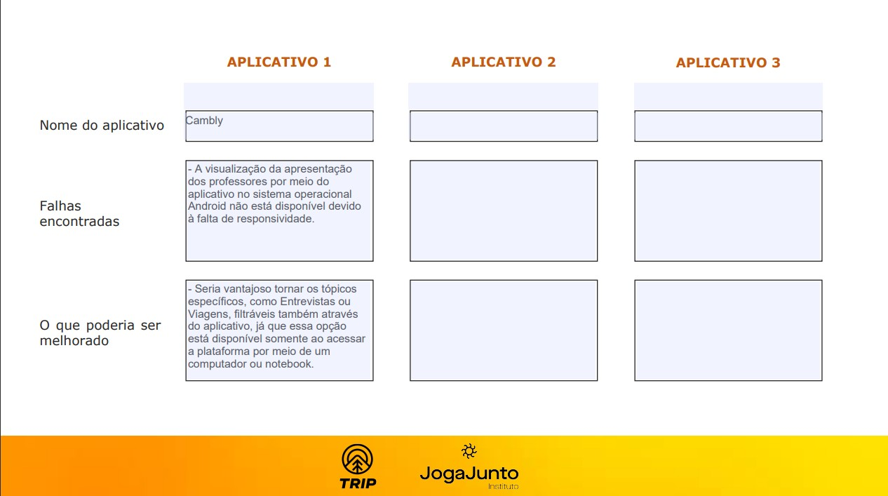

# Atividades do Módulo 3 - QA NA PRÁTICA 📚

Esse [repositório](https://github.com/LeanDevLima/Squad02_M3) é dedicado às atividades realizadas durante o Módulo 3 - QA NA PRÁTICA do curso de Quality Assurance oferecido pelo [**Instituto JogaJunto**](https://www.jogajuntoinstituto.org/). 

Clique nas "►" abaixo para visualizar os conteúdos trabalhados nesse módulo. Para recolher o conteúdo, basta clicar nas "▼" novamente. 😁

🚀 Descrição da 1ª Atividade: 🌟

 

🔍 Responda a pergunta: O que vocês acham que um aplicativo, site ou software precisa ter para ser um sucesso? Listem, no mínimo, 4 características.

 - A seguir, apresento um resumo das discussões em grupo, complementado por minhas contribuições adicionais:

1. **Usabilidade Intuitiva**: A facilidade de uso é fundamental. Um aplicativo ou software deve ser intuitivo, com uma interface de usuário clara e fácil de entender. Quanto mais rápido os usuários conseguirem entender como usar o sistema, mais provável será que eles continuem a usá-lo.

2. **Solução de Problema**: Um aplicativo de sucesso geralmente resolve um problema real para os usuários. Se ele puder oferecer uma solução eficaz e atender às necessidades dos usuários de maneira melhor ou mais eficiente do que as alternativas existentes, terá uma vantagem competitiva.

3. **Desempenho e Confiabilidade**: Os usuários esperam que um aplicativo funcione sem problemas e de maneira consistente. Problemas de desempenho, lentidão ou falhas frequentes podem levar à frustração dos usuários e à perda de confiança no software.

4. **Valor Agregado e Inovação**: Um aplicativo bem-sucedido muitas vezes oferece algo único ou inovador. Se ele puder fornecer um valor único para os usuários, seja por meio de recursos exclusivos, experiências personalizadas ou funcionalidades inovadoras, é mais provável que atraia e retenha um público fiel.

Essas são apenas algumas características importantes, e o sucesso de um aplicativo, site ou software também pode depender de outros fatores, como estratégias de marketing eficazes, suporte ao cliente sólido e adaptação às necessidades em constante evolução dos usuários.

🚀 Descrição da 2ª Atividade: 🌟

 

🔍 Responda a pergunta: Quais características são essenciais para profissionais de QA? Tentem fazer duas listas de características. Uma com a percepção de vocês e outra com base nas pesquisas feitas na internet.

 - A seguir, apresento um resumo das discussões em grupo, complementado por minhas contribuições adicionais:

### Com base na nossa Percepção:

1. **Atenção aos Detalhes:** Profissionais de QA devem ser extremamente detalhistas para identificar até os erros mais sutis nos produtos ou sistemas em teste.

2. **Comunicação Eficaz:** Uma comunicação clara e eficaz é fundamental para relatar bugs e problemas aos desenvolvedores e outros membros da equipe.

3. **Pensamento Analítico:** A capacidade de analisar sistemas complexos, identificar padrões e antecipar possíveis problemas é essencial para um QA.

4. **Conhecimento Técnico:** Compreender os fundamentos técnicos por trás do software e das tecnologias envolvidas ajuda os profissionais de QA a testar com mais eficiência.

5. **Capacidade de Automatização:** A automação de testes é cada vez mais importante. Saber criar e manter scripts de teste automatizados é uma habilidade valiosa.

6. **Flexibilidade:** Os requisitos e o contexto dos projetos de software podem mudar rapidamente. Ser flexível e capaz de se adaptar a essas mudanças é crucial.

7. **Conhecimento do Domínio:** Entender o setor ou a área em que o software será usado ajuda a direcionar os testes para cenários relevantes.

8. **Trabalho em Equipe:** Colaboração eficaz com desenvolvedores e outros membros da equipe.

9. **Resolução de Problemas:** Habilidade em encontrar soluções para desafios complexos de teste.

10. **Foco no Usuário Final:** Garantir que o software atenda às necessidades e expectativas dos usuários.

### Com base em Pesquisas na Internet:

1. **Habilidade Técnica:** Profissionais de QA devem ter conhecimentos técnicos sólidos para entender as aplicações e sistemas que estão testando.

2. **Experiência em Ferramentas de Teste:** Familiaridade com ferramentas de automação, rastreamento de problemas e gerenciamento de testes é essencial.

3. **Compreensão do Processo de Desenvolvimento:** Saber como o desenvolvimento de software ocorre ajuda os QAs a se integrarem melhor às equipes de desenvolvimento.

4. **Capacidade de Documentação:** Documentar meticulosamente os testes realizados e os resultados obtidos é importante para rastrear o progresso e compartilhar informações.

5. **Colaboração Eficiente:** Trabalhar bem em equipe é crucial, já que os QAs precisam coordenar-se com desenvolvedores, gerentes de projeto e outros membros.

6. **Testes Exploratórios:** A capacidade de explorar o software em busca de problemas não óbvios é uma habilidade altamente valorizada.

7. **Conhecimento de Metodologias Ágeis:** Muitas equipes de desenvolvimento adotam metodologias ágeis. O entendimento dessas práticas é útil para QAs.

8. **Acompanhamento de Tendências:** Manter-se atualizado com as últimas tendências em testes e tecnologia.

9. **Gestão de Tempo:** Eficiência na organização de tarefas e priorização de testes.

10. **Mentalidade de Qualidade:** Buscar constantemente a excelência na entrega de software de alta qualidade.

*Lembrando que diferentes empresas e contextos podem valorizar diferentes conjuntos de características, mas essas listas oferecem uma ideia geral das habilidades e conhecimentos necessários para profissionais de QA.*

🚀 Descrição da 3ª Atividade: 🌟

 

🔍 Responda a pergunta: Pesquisem o que é e qual a importância de UX - USER EXPERIENCE, WIREFRAME e COPYWRITING.

 - A seguir, apresento um resumo das discussões em grupo, complementado por minhas contribuições adicionais:

### UX - User Experience (Experiência do Usuário):

**Definição:** A Experiência do Usuário engloba a qualidade geral da interação de um usuário com um produto ou serviço.

**Importância:** Influencia a satisfação, a fidelidade e a eficácia do produto, impactando diretamente a percepção e ação dos usuários.

### Wireframe (Esboço de Estrutura):

**Definição:** Um wireframe é um esboço visual que representa a estrutura básica e a disposição dos elementos em um design interativo.

**Importância:** Proporciona um guia visual inicial para a organização do layout, facilitando a comunicação entre a equipe de design e desenvolvimento.

### Copywriting (Redação Publicitária):

**Definição:** Copywriting é a criação de textos persuasivos para marketing e publicidade, com o objetivo de inspirar ação.

**Importância:** Influi na persuasão, engajamento e conversões, capacitando a comunicação eficaz de mensagens de marketing para o público-alvo.

🚀 Descrição da 4ª Atividade: 🌟

 

🔍 Responda a pergunta: Pesquisem os principais tipos de testes realizados por QA e o que é feito em cada teste. 

 - A seguir, apresento um resumo das discussões em grupo, complementado por minhas contribuições adicionais:

Testes de QA englobam uma variedade de abordagens para verificar a qualidade do software em diferentes níveis. Aqui estão os principais tipos e suas descrições sucintas:

### Testes Unitários:

- **O que é feito:** Testa unidades individuais de código, como funções ou métodos, isoladamente.
- **Objetivo:** Identificar erros em componentes de código pequenos e específicos.

### Testes de Integração:

- **O que é feito:** Verifica a interação entre módulos ou componentes do software.
- **Objetivo:** Detectar problemas de comunicação e colaboração entre diferentes partes do sistema.

### Testes Funcionais:

- **O que é feito:** Avalia as funcionalidades do software, geralmente usando cenários reais de uso.
- **Objetivo:** Verificar se o software se comporta conforme esperado e atende aos requisitos.

### Testes de Aceitação:

- **O que é feito:** Valida se o software está pronto para ser entregue ao cliente, com base nos critérios de aceitação.
- **Objetivo:** Garantir que o software atenda aos padrões e às expectativas do cliente.

### Testes de Desempenho:

- **O que é feito:** Avalia a resposta do sistema sob diferentes condições de carga e estresse.
- **Objetivo:** Identificar gargalos de desempenho e otimizar o software para um melhor rendimento.

### Testes de Segurança:

- **O que é feito:** Verifica vulnerabilidades e falhas de segurança do sistema.
- **Objetivo:** Proteger o software contra ameaças e ataques maliciosos.

### Testes de Usabilidade:

- **O que é feito:** Avalia a experiência do usuário e a facilidade de uso do software.
- **Objetivo:** Garantir que o software seja intuitivo e agradável para os usuários.

### Testes de Compatibilidade:

- **O que é feito:** Testa o software em diferentes dispositivos, navegadores ou ambientes.
- **Objetivo:** Assegurar que o software funcione corretamente em diversas plataformas.

### Testes de Regressão:

- **O que é feito:** Reexecuta testes anteriores para verificar se novas alterações causaram regressões.
- **Objetivo:** Garantir que mudanças recentes não afetem áreas previamente testadas.

### Testes de Aceitação do Usuário (UAT):

- **O que é feito:** Testes finais conduzidos pelo cliente ou usuário final.
- **Objetivo:** Confirmar que o software atende às expectativas do usuário antes da implantação.

Cada tipo de teste desempenha um papel importante na identificação de diferentes tipos de problemas no software e na garantia de sua qualidade global.

🚀 Descrição da 5ª Atividade: 🌟

 

🔍 Responda a pergunta: Escolha três aplicativos que já possua em seu celular. Explore os três aplicativos. Liste: possíveis falhas encontradas > elementos que poderiam ser mudados ou acrescentados para melhorar o aplicativo

 - Para essa atividade cada inegrante da Squad escolheu um app que já possuiam mais intimidade. No meu caso eu ecolho o Cambly que adquiri recentemente com o propósito de melhorar minha conversação no idioma Inglês.

Obs: Os outros campos estão em branco pois foram preenchidos pelos colegas da squad em seus próprios trabalhos.

## Integrantes da Squad:

| Beatriz Souza  | Bruno Soares  | [Leanderson Lima](https://www.linkedin.com/in/leanderson-dias-de-lima/) | [Rebeca Borges](https://www.linkedin.com/in/rebecaborgess/) | Sara Cruz | 

